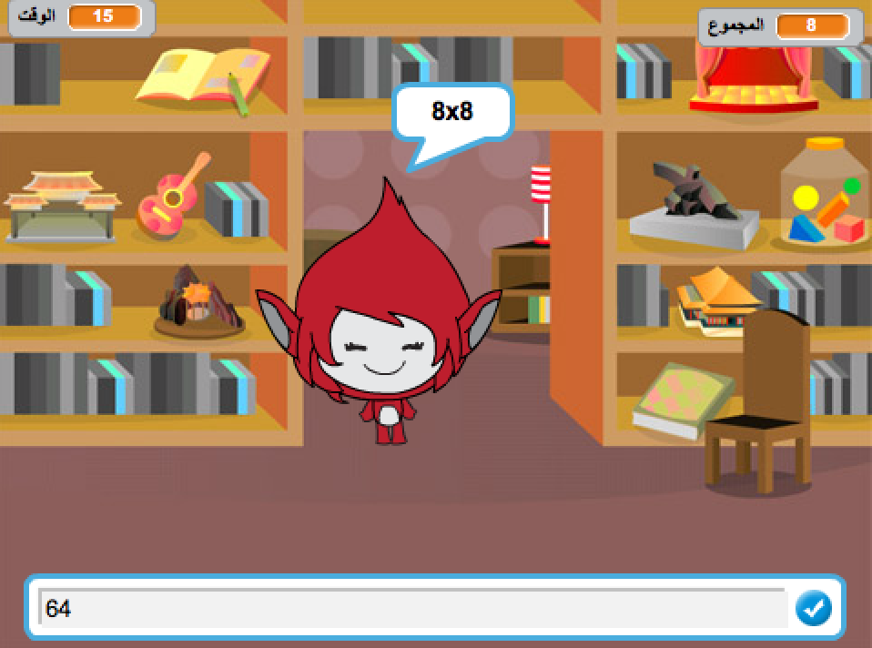

## المقدمة

في هذا المشروع، ستتعلم كيف تنشئ اختبارًا قصيرًا في فترة زمنية محددة، بحيث تجيب فيه على أكثر عدد ممكن من الإجابات صحيحة خلال 30 ثانية.

  <iframe allowtransparency="true" width="485" height="402" src="https://scratch.mit.edu/projects/embed/42225768/?autostart=false" frameborder="0"></iframe>
  

### معلومات إضافية لقادة النادي

إذا كنت بحاجة إلى طباعة هذا المشروع، فيُرجى استخدام [النسخة القابلة للطباعة](https://projects.raspberrypi.org/en/projects/brain-game/print).

## \--- collapse \---

## title: ملاحظات قادة النادي

## المقدمة:

في هذا المشروع، سيتعلم الأطفال كيفية إنشاء لعبة الإختبار القصير، بحيث يجيب فيه اللاعب على أكبر عدد ممكن من الإجابات صحيحة خلال 30 ثانية.

## الموارد

يجب إستخدام برنامج Scratch 2 لهذا المشروع. يمكن استخدام Scratch 2 إما عبر الإنترنت في [jumpto.cc/scratch-on](http://jumpto.cc/scratch-on) أو يمكن تنزيلها من [ jumpto.cc/scratch-off ](http://jumpto.cc/scratch-off) واستخدامها في وضع عدم الاتصال.

يمكنك العثور على نسخة مكتملة من هذا المشروع [عبر الإنترنت](http://scratch.mit.edu/projects/42225768/#editor) أو يمكن تنزيله بالنقر فوق رابط "مواد المشروع" لهذا المشروع ، والذي يحتوي على:

* BrainGame.sb2

## أهداف التعلم

* يدعم هذا المشروع تعلم مهارات البرمجة التي تم تعلمها مسبقًا، ويوضح كيف يمكن استخدام البث لإنشاء نظام قائمة ألعاب بسيطة.

يتناول هذا المشروع عناصر من معايير المناهج الرقمية الخاصة بـ [Raspberry Pi](http://rpf.io/curriculum):

* [الجمع بين برمجة التركيبات لحل المشكلة.](https://www.raspberrypi.org/curriculum/programming/builder)

## التحديات

* "تغيير المظاهر" - تغيير مظهر شخصية اللعبة وفقًا للإجابات الصحيحة وغير الصحيحة؛
* "إضافة درجة" - إضافة نقطة لكل سؤال صحيح تمت الإجابة عليه؛
* "شاشة البدء" - تغيير خلفية المنصة وفقًا لرسالتَي البث `بدء`{:class="blockevents"} و`إنهاء`{:class="blockevents"}، وهو ما يؤدي إلى إنشاء 'شاشة' ثانية للعبة؛
* "الرسوم المتحركة المحسنة" - استخدام حلقات التكرار والمؤثرات لتحسين الرسوم المتحركة للإجابات الصحيحة أو غير الصحيحة؛
* "الصوت والموسيقى" - دعم تعلم حلقات التكرار الموسيقى والمؤثرات الصوتية؛
* "سباق حتى 10 نقاط" - تغيير منطق اللعبة لإنشاء أهداف جديدة للعبة؛
* "شاشة التعليمات" - دعم استخدام رسائل البث لإنشاء قائمة للعبة، وذلك عن طريق إضافة زر وشاشة جديدَين لـ 'التعليمات'.

\--- /collapse \---

## \--- /collapse \---

## title: مواد المشروع

## موارد قادة النادي

* [مشروع Scratch 2 مكتمل قابل للتنزيل](resources/BrainGame.sb2)
* [مشروع Scratch 2 مكتمل عبر الإنترنت](http://scratch.mit.edu/projects/42225768/#editor)

\--- /collapse \---