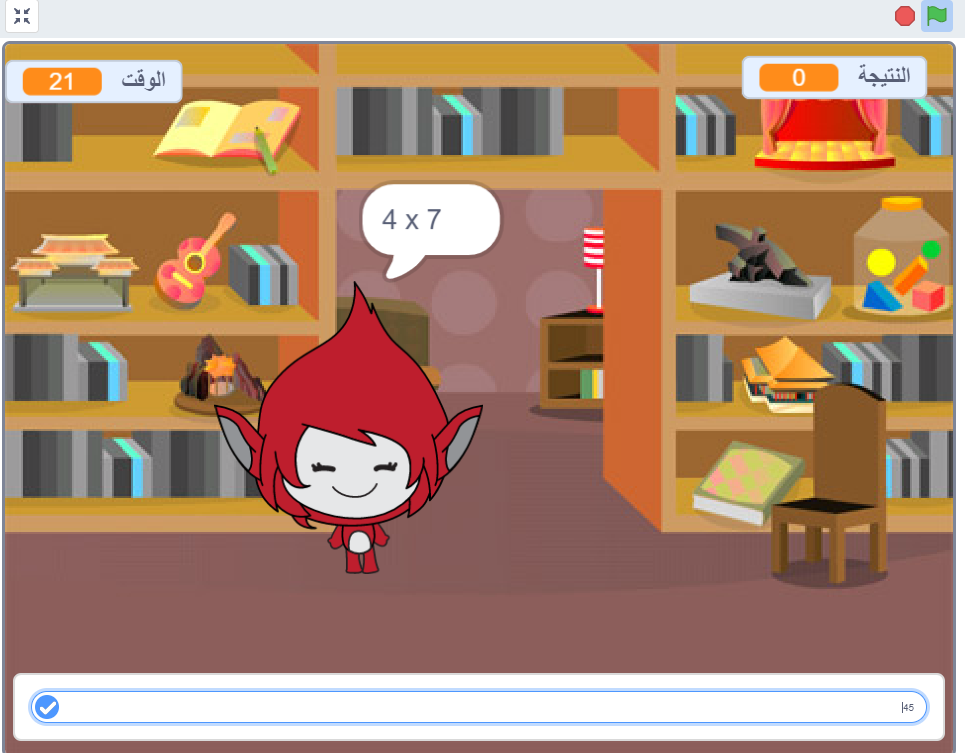

\--- no-print \---

هذا هو إصدار ** Scratch 3 ** من المشروع. هناك أيضًا [ إصدار Scratch 2 للمشروع ](https://projects.raspberrypi.org/en/projects/brain-game-scratch2).

\--- /no-print \---

## المقدمة

في هذا المشروع، ستقوم بإنشاء لعبة اختبار للرياضيات يكون للاعب خلالها 30 ثانية لإعطاء أكبر عدد ممكن من الإجابات الصحيحة.

### ما الذي ستقوم به

\--- no-print \---

انقر فوق الزر للبدء. اكتب إجابة السؤال ثم اضغط على مفتاح<kbd> Enter </kbd>.

  <iframe allowtransparency="true" width="485" height="402" src="https://scratch.mit.edu/projects/embed/250234955/?autostart=false" frameborder="0" scrolling="no"></iframe>
  

\--- /no-print \---

\--- print-only \---

\--- /print-only \---

## \--- collapse \---

## title: ما الذي ستتعلمه

+ كيف تستخدم بث رسالة في Scratch
+ كيفية إنشاء واستخدام كتلة برمجية مخصصة في Scratch

\--- /collapse \---

## \--- collapse \---

## title: ما الذي ستحتاجه

### الأجهزة

+ جهاز كمبيوتر يدعم تشغيل برنامج Scratch 3

### البرامج

+ برنامج Scratch 3 (سواء أكان [عبر الإنترنت](https://rpf.io/scratchon){:target="_blank"} أو [دون اتصال بالإنترنت](https://rpf.io/scratchoff){:target="_blank"})

\--- /collapse \---

## \--- collapse \---

## title: ملاحظات إضافية للمعلمين

\--- no-print \---

إذا كنت بحاجة إلى طباعة هذا المشروع، فيُرجى استخدام نسخة [سهلة الطباعة.](https://projects.raspberrypi.org/en/projects/brain-game/print).

\--- /no-print \---

يمكنك الحصول على [المشروع كاملاً من هنا](https://rpf.io/p/en/brain-game-get){:target="_blank"}.

\--- /collapse \---