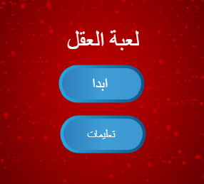

## التحدي: شاشة التعليمات

هل تستطيع إضافة شاشة التعليمات الى لعبتك، توضح للاعب كيف يلعب اللعبة؟ ستحتاج إلى زر 'التعليمات'، وخلفية منصة أخرى.



قد تحتاج أيضًا إلى إضافة زر "رجوع" يتيح للاعب العودة إلى شاشة البدء.

```blocks3
    بث رسالة (شاشة البدء v)
```