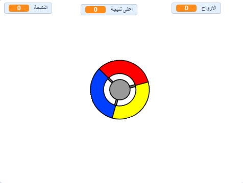

## ما هي الخطوة التالية؟

جرب مشروع [ امسك النقاط ](https://projects.raspberrypi.org/ar-SA/projects/catch-the-dots?utm_source=pathway&utm_medium=whatnext&utm_campaign=projects) لإنشاء لعبة رد الفعل! في هذا المشروع، سوف تتعلم كيف تنشىء نسخ من الكائنات، وكيف تستخدم متغير لتسريع اللعبة تدريجيا.

--- no-print ---

استخدم مفاتيح الأسهم من لوحة المفاتيح لتدوير عجلة وحدة التحكم والتقط النقاط الطائرة عند وصولها إلى المركز. إذا فاتتك ثلاث نقاط ، تكون اللعبة قد انتهت.

  <iframe allowtransparency="true" width="485" height="402" src="https://scratch.mit.edu/projects/embed/374212555/?autostart=false" frameborder="0" scrolling="no"></iframe>
  

--- /no-print ---

--- print-only ---

--- /print-only ---

***
تمت ترجمة هذا المشروع بواسطة متطوعين:

علي عادل علي

رائد موسى الجعفري

وجدان فارس الطويرقي

عبدالعزيز عبدالله الفائز

بفضل المتطوعين ، يمكننا إعطاء الناس في جميع أنحاء العالم فرصة للتعلم بلغتهم الخاصة. يمكنك مساعدتنا في الوصول إلى المزيد من الأشخاص من خلال التطوع للترجمة - مزيد من المعلومات على [rpf.io/translate](https://rpf.io/translate).