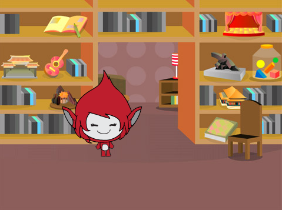
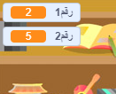

## إنشاء أسئلة

لنبدأ بإنشاء أسئلة عشوائية ليجيب عنها اللاعب.

+ ابدأ مشروع Scratch جديد، واحذف كائن القطة ليكون المشروع فارغًا. يمكنك العثور على محرر الرسم لبرنامج Scratch عبر الإنترنت على <a href="http://jumpto.cc/scratch-new" target="_blank">jumpto.cc/scratch-new</a>.

+ اختر شخصية وخلفية للعبتك. يمكنك اختيار ما يعجبك! إليك مثالًا:
    
    

+ أنشئ متغيرَين جديدَين أحدهما يُسمى الرقم `number 1`{:class="blockdata"} والآخر يُسمى الرقم `number 2`{:class="blockdata"}. سيخزِّن هذان المتغيران الرقمَين اللذين سيتم ضربهما معًا.
    
    

+ أضف تعليمة برمجية إلى الشخصية، لتعيين كِلا المتغيرين إلى `رقم عشوائي`{:class="blockoperators"} بين 2 و12.
    
    ```blocks
        عند نقر ⚑
     	اجعل [number 1 v] مساوياً (اختر عدداً عشوائياً بين (2) و (12))
     	اجعل [number 2 v] مساوياً (اختر عدداً عشوائياً بين (2) و (12))
    ```

+ يمكنك حينئذٍ أن تطلب من اللاعب الإجابة ليعرف ما إذا كانت إجابته صحيحة أم غير صحيحة.
    
    ```blocks
        when flag clicked
        set [number 1 v] to (pick random (2) to (12))
        set [number 2 v] to (pick random (2) to (12))
        ask (join (number 1)(join [ x ] (number 2))) and wait
        if <(answer) = ((number 1)*(number 2))> then
            say [yes! :)] for (2) secs
        else
            say [nope :(] for (2) secs
        end
    ```

+ Test your project fully, by answering one question correctly and one with the wrong answer.

+ Add a `forever`{:class="blockcontrol"} loop around this code, so that the player is asked lots of questions.

+ Create a countdown timer on the stage, using a variable called `time`{:class="blockdata"}. The 'Ghostbusters' project has instructions for making a timer (in step 5) if you need help!

+ Test your project again - you should be able to continue asking questions until the time runs out.