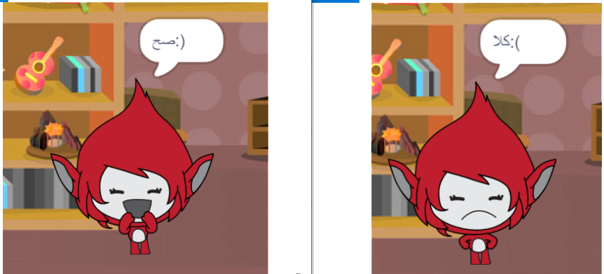

## التحدي: إضافة سجل نقاط وردود فعل

هل يمكنك إضافة سجل النقاط إلى لعبتك؟

يمكنك إضافة تعليمة برمجية بحيث يسجل للاعب نقطة لكل إجابة صحيحة. إذا كنت تشعر بعدم الرضا، يمكنك أيضًا إضافة تعليمة برمجية لإعادة سجل نقاط اللاعب إلى الصفر في حال أعطوا إجابة خاطئة!

[[[generic-scratch3-high-score]]]

هل يمكنك جعل الكائن او شخصيتك تتفاعل مع إجابة اللاعب بالتغيير إلى شكل مختلف إذا كانت الإجابة صحيحة أو غير صحيحة؟

