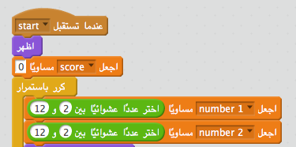

## ألعاب متعددة

لنضِف زر 'لعب' إلى لعبتك، بحيث يمكنك اللعب أكثر من مرة.

+ أنشئ زرًا جديدًا يُسمى 'لعب' على شكل كائن معين، بحيث ينقر فوقه اللاعب لبدء لعبة جديدة. يمكنك رسم الكائن بنفسك، أو تحرير كائن من مكتبة Scratch.
    
    

+ أضف هذه التعليمة البرمجية إلى الزر.
    
    ```blocks
        عند نقر ⚑
    اظهر
    
    عند نقر هذا الكائن
    اختف
    بث [start v]
    ```
    
    تُظهر هذه التعليمة البرمجية زر (العب) عندما يبدأ المشروع. عند النقر على الزر، يختفي ثم يبث رسالة بدء اللعبة.

+ ستحتاج إلى تحرير التعليمة البرمجية للشخصية، بحيث تبدأ اللعبة عندما تتلقى رسالة `بدء`{:class="blockevents"} ، لا عند النقر على العلم.
    
    استبدل التعليمة البرمجية `عند النقر على العلم`{:class="blockevents"} بالتعليمة `عندما أتلقى بدء`{:class="blockevents"}.
    
    

+ انقر على العلم الأخضر ثم انقر على زر (لعب) الجديد لاختباره. سترى أن اللعبة لا تبدأ إلا عند النقر على الزر.

+ هل لاحظتَ أن الموقِّت يبدأ عند النقر على العلم الأخضر، لا عندما تبدأ اللعبة؟
    
    
    
    هل يمكنك إصلاح هذه المشكلة؟

+ انقر على المنصة، واستبدل التعليمة البرمجية `أوقف الكل`{:class="blockcontrol"} برسالة `إنهاء`{:class="blockevents"}.
    
    

+ يمكنك الآن إضافة تعليمة برمجية إلى الزر، لإظهاره مرة أخرى في نهاية كل لعبة.
    
    ```blocks
        عندما تستقبل [end v]
    اظهر
    ```

+ ستحتاج أيضًا إلى إيقاف الشخصية عن طرح الأسئلة في نهاية كل لعبة:
    
    ```blocks
        عندما تستقبل [end v]
    أوقف [المقاطع الأخرى في الكائن v]
    ```

+ العب عدة مرات لإختبار زر (لعب). ستلاحظ أن زر (لعب) يظهر بعد نهاية كل لعبة. لتسهيل الاختبار، يمكنك تقليل زمن كل لعبة بحيث تستمر لبضع ثوان فقط.
    
    ```blocks
        اجعل [الساعة v] مساوياً [10]
    ```

+ يمكنك أيضًا تغيير شكل الزر عند وضع الماوس فوقه.
    
    ```blocks
        عند نقر ⚑
    اظهر
    كرر باستمرار 
      إذا <touching [mouse-pointer v]?> 
        اجعل تأثير [عين السمكة v] مساوياً (30)
      
        اجعل تأثير [عين السمكة v] مساوياً (0)
      end
    end
    ```
    
    