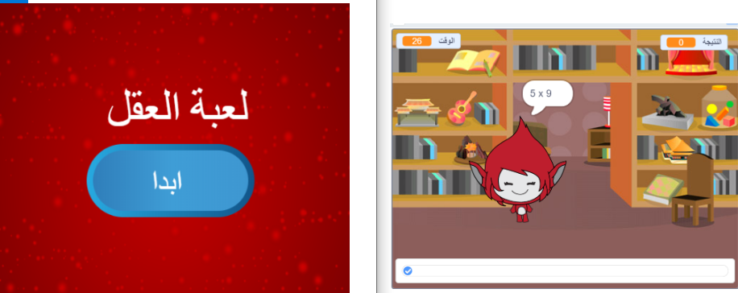

\--- challenge \---

## تحدي: شاشة البدء

هل يمكنك إضافة خلفية أخرى إلى المنصة، لتكون شاشة بدء للعُبتك؟ يمكنك استخدام القالبين البرمجيين `عندما أتلقى بدء`{:class="blockevents"} و`عندما أتلقى إنهاء`{:class="blockevents"} للتبديل بين الخلفيتين.

يمكنك أيضًا إظهار الشخصية وإخفاؤها، بل وإظهار الموقِّت وإخفاؤه باستخدام هذين القالبين:

```blocks
أظهر المتغير [الوقت v]
```

```blocks
أخفِ المتغير [الوقت v]
```



\--- /challenge \---