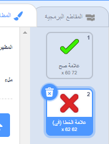
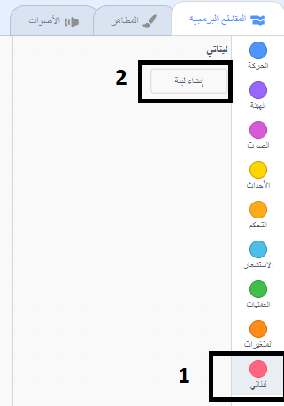

## إضافة رسومات

في هذه اللحظة، الكائن او الشخصية يقول فقط `نعم! :)` أو `لا :(` لإجابات اللاعب. أضف بعض الرسوم او الاشكال لإطلاع اللاعب على ما إذا كانت إجابته صحيحة أو غير صحيحة.

--- task ---

أنشئ كائنًا جديدًا يُسمى 'النتيجة'، يحتوي على مظهر '✓' ومظهر '✘'.



---/task--

--- task ---

قم بتغيير التعليمة البرمجية للكائن الخاص بك بحيث أنه بدلاً من قول شيء إلى اللاعب، `يبث `{:class="block3events"} الرسائل 'صح' أو 'خطأ'.


```blocks3
if <(answer) = ((العدد 1)*(العدد 2))> then
- say [نعم! :)] for (2) seconds
+ broadcast (صحيح v)
else
- say [لا :(] for (2) seconds
+ broadcast (خطأ v)
end
```

--- /task ---

--- task ---

الآن يمكنك استخدام هذه الرسائل `لإظهار `{:class="block3looks"} المظهر"صح" أو "خطا". أضف التعليمات البرمجية التالية إلى كائن'النتيجة':


```blocks3
    when I receive [صحيح v]
    switch costume to (علامة صح v)
    show
    wait (1) seconds
    hide

    when I receive [خطأ v]
    switch costume to (علامة الخطا (في) v)
    show
    wait (1) seconds
    hide

    when flag clicked
    hide
```

--- /task ---

--- task ---

اختبر لعبتك مرة أخرى. سترى علامة ✓ عندما تجيب إجابة صحيحة، وعلامة ✘ عندما تجيب إجابة غير صحيحة!


--- /task ---

هل لاحظتَ أن التعليمتَين البرمجيتَين لكل من `عندما أتلقى صح`{:class="blockevents"} و`عندما أتلقى خطأ`{:class="blockevents"} متماثلتَان تقريبًا؟

حتى تتمكن من تغيير التعليمة البرمجية الخاص بك بسهولة أكبر ، ستقوم بإنشاء تعليمة مخصصة.

--- task ---

حدد كائن 'النتيجة'. ثم انقر فوق ` تعليماتي البرمجية`{:class="block3myblocks"} ، ثم على **إنشاء تعليمة**. قم بإنشاء تعليمة جديدة تدعى `حركة حيوية`{:class="block3myblocks"}.




--- /task ---

--- task ---

نقل التعليمة البرمجية إلى `عرض `{:class="block3looks"} و `إخفاء `{:class="block3looks"} كائن "النتيجة" إلى تعليمة`حركة حيوية`{:class="block3myblocks"}:


```blocks3
define تحريك
show
wait (1) seconds
hide
```

--- /task ---

--- task ---

تأكد من أنك قمت بإزالة التعليمةالبرمجية `عرض`{:class="block3looks"} و `إخفاء `{:class="block3looks"} أسفل **التعليمتين** من `غير المظهر`{:class="block3looks"}.

ثم أضف التعليمة`حركة حيوية`{:class="block3myblocks"} أسفل التعليمة`تبديل المظهر `{:class="block3looks"}. يجب أن تبدو التعليمة الخاص بك الآن كما يلي:


```blocks3
    when I receive [صحيح v]
    switch costume to (علامة صح v)
    تحريك:: custom

    when I receive [خطأ v]
    switch costume to (علامة الخطا (في) v)
    تحريك:: custom
```

--- /task ---

بسبب مظهر`حركة حيوية`{:class="block3myblocks"} ، ما عليك سوى إجراء تغيير واحد على تعليمتك البرمجية إذا كنت تريد إظهار مظاهر الكائن "النتيجة" لفترة أطول أو أقصر.

--- task ---

قم بتغيير التعليمة البرمجية الخاص بك بحيث يتم عرض المظاهر"الصح" أو "الخطا" لمدة ثانيتين.

--- /task ---

--- task ---

بدلاً من `إظهار`{:class="block3looks"} و `إخفاء`{:class="block3looks"} مظاهر"الصح" أو "الخطا" ، يمكنك تغيير `الحركة الحيوية`{:class="block3myblocks"} حتى تتلاشى الأزياء.


```blocks3
    define تحريك
    set [ghost v] effect to (100)
    show
    repeat (25)
        change [ghost v] effect by (-4)
    end
    hide
```

--- /task ---

هل يمكنك تحسين الرسوم المتحركة للرسومات "الصح" أو "الخطا"؟ يمكنك إضافة تعليمة برمجية لجعل المظاهرتتلاشى أيضًا ، أو يمكنك استخدام تأثيرات رائعة أخرى:

