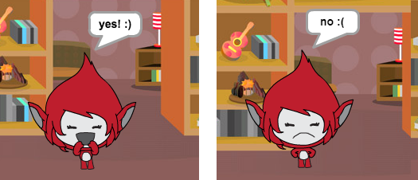

## Desafiament: afegiu una puntuació i reaccions

Pots afegir una puntuació al teu joc?

Podeu afegir codi perquè el jugador puntuï un punt per a cada resposta correcta. Si se sent bé, també podeu afegir codi per restablir la puntuació del jugador a zero si donen una resposta equivocada.

[[[generic-scratch3-high-score]]]

Pot fer que el seu personatge reaccioni davant la resposta del jugador canviant a un vestit diferent si la resposta és correcta o incorrecta?

