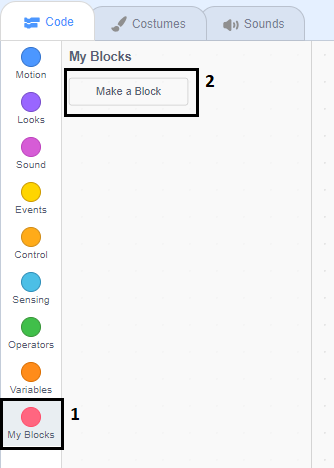

## Přidej grafiku

Zatím tvá postava reaguje na hráčovy odpovědi bublinkou `jo! :)` nebo `ne :(`. Pojďme hru vylepšit novou grafikou ze které hráč pozná jestli jeho odpověď byla správná nebo ne.

\--- task \---

Vytvoř novou postavu 'Výsledek' a přidej ji kostým 'Fajfka' a 'Křížek'.


\--- /task \---

\--- task \---

Uprav scénář u postavy tak, aby namísto povídání odesílala `zprávu`{:class="block3events"} 'správně' nebo 'špatně'.


```blocks3
if <(answer) = ((number 1)*(number 2))> then

- say [yes! :)] for (2) seconds
+ broadcast (correct v)
else
- say [nope :(] for (2) seconds
+ broadcast (wrong v)
end
```

\--- /task \---

\--- task \---

Teď můžeš díky zprávám `zobrazit` kostým 'fajfky' nebo 'křížku'. Přidej následující kód ke scénaři postavy 'Výsledek':


```blocks3
    when I receive [correct v]
    switch costume to (tick v)
    show
    wait (1) seconds
    hide

    when I receive [wrong v]
    switch costume to (cross v)
    show
    wait (1) seconds
    hide

    when flag clicked
    hide
```

\--- /task \---

\--- task \--- Čas na testování! Po každé správné odpovědi by se ti měla zobrazit fajka a křížek po každé chybě.


\--- /task \---

Všiml sis že kód pro `po obdržení zprávy správně`{:class="block3events"} a `po obdržení zprávy špatně`{:class="block3events"} je skoro stejný?

Aby se nám v budoucnu kód lépe spravoval uděláme z něj tzv. vlastní blok.

\--- task \---

Vyber postavu 'Výsledek'. Klikni do sekce `Moje bloky`{:class="block3myblocks"} a pak na na tlačítko **Vytvořit blok**. Vytvoř nový blok a pojmenuj jej `animuj`{:class="block3myblocks"}.




\--- /task \---

\--- task \--- Přesuň kód který `zobrazoval`{:class="block3looks"} a `schovával`{:class="block3looks"} postavu 'Výsledek' do bloku `animuj`{:class="block3myblocks"}:


```blocks3
define animate
show
wait (1) seconds
hide
```

\--- /task \---

\--- task \--- Zkontroluj že jsi opravdu odstranil bloky `ukaž se`{:class="block3looks"} a `skryj se`{:class="block3looks"} pro **obě** verze bloku `změň kostým`.

A teď přidej blok `animuj`{:class="block3myblocks"} k oboum blokům `změň kostým`{:class="block3looks"}. Tvůj kód by měl vypadat takto:


```blocks3
    when I receive [correct v]
    switch costume to (tick v)
    animate:: custom

    when I receive [wrong v]
    switch costume to (cross v)
    animate:: custom
```

\--- /task \---

Když by si chtěl zobrazit postavu 'Výsledek' na delší či kratší dobu, budeš teď díky vlastnímu bloku `animuj`{:class="block3myblocks"} muset upravit pouze jediné místo v kódu.

\--- task \---

Uprav kód tak aby se kostým 'Fajfka' nebo 'Křížek' zobrazil na 2 sekundy.

\--- /task \---

\--- task \--- Instead of `showing`{:class="block3looks"} and `hiding`{:class="block3looks"} the 'tick' or 'cross' costumes, you could change your `animate`{:class="block3myblocks"} block so that the costumes fade in.


```blocks3
    define animate
    set [ghost v] effect to (100)
    show
    repeat (25)
        change [ghost v] effect by (-4)
    end
    hide
```

\--- /task \---

Can you improve the animation of the 'tick' or 'cross' graphics? You could add code to make the costumes fade out as well, or you could use other cool effects:

