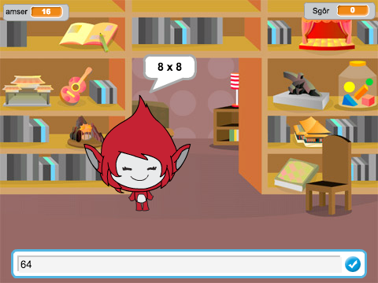

--- no-print ---

Dyma fersiwn **Scratch 3** y prosiect. Ceir hefyd [fersiwn Scratch 2 o'r prosiect](https://projects.raspberrypi.org/cy-GB/projects/brain-game-scratch2).

--- /no-print ---

## Cyflwyniad

Yn y prosiect hwn byddwch yn creu gêm cwis mathemateg lle mae gan y chwaraewr 30 eiliad i roi cymaint o atebion cywir â phosibl.

### Yr hyn byddi di'n ei greu

--- no-print --- 

Clicia'r botwm i ddechrau. Teipia'r ateb i'r cwestiwn, yna pwya <kbd>Enter</kbd>.

  <iframe allowtransparency="true" width="485" height="402" src="https://scratch.mit.edu/projects/embed/334754480/?autostart=false" frameborder="0" scrolling="no"></iframe>
  

--- /no-print ---

--- print-only --- 

 

--- /print-only ---

--- collapse ---
---
title: Yr hyn byddi di'n ei ddysgu
---

+ Sut i ddefnyddio darllediadau yn Scratch
+ Sut i greu a defnyddio bloc Scratch

--- /collapse ---

--- collapse ---
---
title: Beth fydd ei angen arno ti
---

### Caledwedd

+ Cyfrifiadur sy'n gallu rhedeg Scratch 3

### Meddalwedd

+ Scratch 3 (unai [arlein](http://rpf.io/scratchon){:target="_blank"} neu [all-lein](http://rpf.io/scratchoff){:target="_blank"})

--- /collapse ---

--- collapse ---
---
title: Gwybodaeth ychwanegol i addysgwyr
---
--- no-print ---

Os oes angen i chi argraffu y prosiect, defnyddiwch [fersiwn i'w argraffu](https://projects.raspberrypi.org/cy-GB/projects/brain-game/print). 

--- /no-print ---

Gallwch chi ddod o hyd i'r [ateb ar gyfer y prosiect hwn yma](http://rpf.io/p/cy-GB/brain-game-get){:target="_blank"}.

--- /collapse ---
