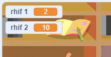

## Creu cwestiynau

Fe wnawn ni ddechrau trwy greu cwestiynau ar hap i’r chwareuwr ateb.

\--- task \---

Agora prosiect Scratch newydd.

**Online:** open a new online Scratch project at [rpf.io/scratch-new](http://rpf.io/scratch-new){:target="_blank"}.

**All-lein** agora brosiect newydd yn y golygydd all-lein.

Os oes angen i ti lawrlwytho a gosod golygydd Scratch all-lein, mae modd dod o hyd iddo yma [rpf.io/scratchoff](http://rpf.io/scratchoff){:target="_blank"}.

\--- /task \---

\--- task \--- Dewisa gymeriad a chefndir i dy gêm. Fe alli di ddewis unrhywbeth! Dyma enghraifft:


\--- /task \---

\--- task \--- Sicrha fod dy gymeriad wedi ei ddewis. Bydd angen creu 2 newidyn o’r enw `rhif 1`{:class="block3variables"} a `rhif 2`{:class="block3variables"}, i storio y rhifau ar gyfer y cwestiynau cwis.

 

[[[generic-scratch3-add-variable]]]

\--- /task \---

\--- task \--- Ychwanegu côd i dy gymeriad i osod y ddau `newidyn`{:class="block3variables"} i rif `ar hap`{:class="block3operators"} rhwng 2 a 12.


```blocks3
pan fo'r flag werdd yn cael ei glicio
gosod [rhif 1 v] i (dewis ar hap (2) i (12))
gosod [rhif 2 v] i (dewis ar hap (2) i (12))
```

\--- /task \---

\--- task \--- Ychwanega gôd i `ofyn`{:class="block3sensing"} i'r chwareuwr am ateb, yna `dweud am 2 eiliad`{:class="block3looks"} os yw'r ateb yn gywir neu anghywir:


```blocks3
pan fo'r flag werdd yn cael ei glicio
gosod [rhif 1 v] i (dewis ar hap (2) i (12))
gosod [rhif 2 v] i (dewis ar hap (2) i (12))

+ gofyn (uno (rhif 1) (uno [ x ] (rhif 2))) ac aros
+ os <(ateb) = ((rhif 1) * (rhif 2))> yna 
+ dweud [Ie! :)] am (2) eiliad
+ fel arall 
+ dweud [Na :(] am (2) eiliad
+ end
```

\--- /task \---

\--- task \---

Profa dy brosiect ddwywaith: ateba un cwestiwn yn gywir a'r llall yn anghywir.

\--- /task \---

\--- task \---

Ychwanega ddolen `am byth` {:class="block3control"} o amgylch y côd, fel bod y chwareuwr yn cael llawer o gwestiynau.

\--- hints \--- \--- hint \---

Mae angen i ti ychwanegu bloc `am byth`{:class="block3control"}, a rhoi'r côd i gyd heblaw am `pan fo'r faner wedi ei glicio`{:class="block3control"} ynddo.

\--- /hint \--- \--- hint \--- Dyma'r bloc côd rwyt ti eu hangen:

```blocks3
am byth
end
```

\--- /hint \--- \--- hint \--- Dyma sut ddylai dy gôd edrych:

```blocks3
+ pan fo'r flag werdd yn cael ei glicio

am byth 
  gosod [rhif 1 v] i (dewis ar hap (2) i (12))
  gosod [rhif 2 v] i (dewis ar hap (2) i (12))
  gofyn (uno (rhif 1) (uno [ x ] (rhif 2))) ac aros
  os <(ateb) = ((rhif 1) * (rhif 2))> yna 
    dweud [Ie! :)] am (2) eiliad
  fel arall 
    dweud [Na :(] am (2) eiliad
  end
end
```

\--- /hint \--- \--- /hints \---

\--- /task \---