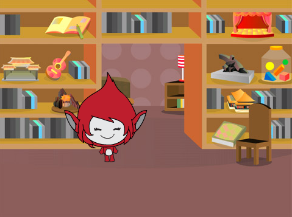
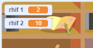

## Creu cwestiynau

Fe wnawn ni ddechrau trwy greu cwestiynau ar hap i’r chwareuwr ateb.

--- task ---

Agora prosiect Scratch newydd.

**Arlein:** agora brosiect Scratch newydd yma [rpf.io/scratch-new](https://rpf.io/scratchon){:target="_blank"}.

**All-lein** agora brosiect newydd yn y golygydd all-lein.

Os oes angen i ti lawrlwytho a gosod golygydd Scratch all-lein, mae modd dod o hyd iddo yma [rpf.io/scratchoff](https://rpf.io/scratchoff){:target="_blank"}.

--- /task ---

--- task ---

Dewisa gymeriad a chefndir i dy gêm. Fe alli di ddewis unrhywbeth! Dyma enghraifft:



--- /task ---

--- task ---

Sicrha fod dy gymeriad wedi ei ddewis. Bydd angen creu 2 newidyn o’r enw `rhif 1`{:class="block3variables"} a `rhif 2`{:class="block3variables"}, i storio y rhifau ar gyfer y cwestiynau cwis.

 

[[[generic-scratch3-add-variable]]]

--- /task ---

--- task ---

Ychwanegu côd i dy gymeriad i osod y ddau `newidyn`{:class="block3variables"} i rif `ar hap`{:class="block3operators"} rhwng 2 a 12.


```blocks3
when flag clicked
set [rhif 1 v] to (pick random (2) to (12))
set [rhif 2 v] to (pick random (2) to (12))
```

--- /task ---

--- task ---

Ychwanega gôd i `ofyn`{:class="block3sensing"} i'r chwareuwr am ateb, yna `dweud am 2 eiliad`{:class="block3looks"} os yw'r ateb yn gywir neu anghywir:


```blocks3
when flag clicked
set [rhif 1 v] to (pick random (2) to (12))
set [rhif 2 v] to (pick random (2) to (12))
+ ask (join (rhif 1)(join [ x ] (rhif 2))) and wait
+ if <(answer) = ((rhif 1)*(rhif 2))> then
+ say [Ie! :)] for (2) seconds
+ else
+ say [Na :(] for (2) seconds
+ end
```

--- /task ---

--- task ---

Profa dy brosiect ddwywaith: ateba un cwestiwn yn gywir a'r llall yn anghywir.

--- /task ---

--- task ---

Ychwanega ddolen `am byth`{:class="block3control"} o amgylch y côd, fel bod y chwareuwr yn cael llawer o gwestiynau.

--- hints ---
 --- hint ---

Mae angen i ti ychwanegu bloc `am byth`{:class="block3control"}, a rhoi'r côd i gyd heblaw am `pan fo'r faner wedi ei glicio`{:class="block3control"} ynddo.

--- /hint ---

--- hint ---

Dyma'r bloc côd rwyt ti eu hangen:

```blocks3
forever
end
```

--- /hint ---

--- hint ---

Dyma sut ddylai dy gôd edrych:

```blocks3
when flag clicked
+ forever
  set [rhif 1 v] to (pick random (2) to (12))
  set [rhif 2 v] to (pick random (2) to (12))
  ask (join (rhif 1) (join [ x ] (rhif 2))) and wait
  if <(answer) = ((rhif 1) * (rhif 2))> then 
    say [Ie! :)] for (2) seconds
  else 
    say [Na :(] for (2) seconds
  end
end
```

--- /hint ------ /hints ---

--- /task ---
