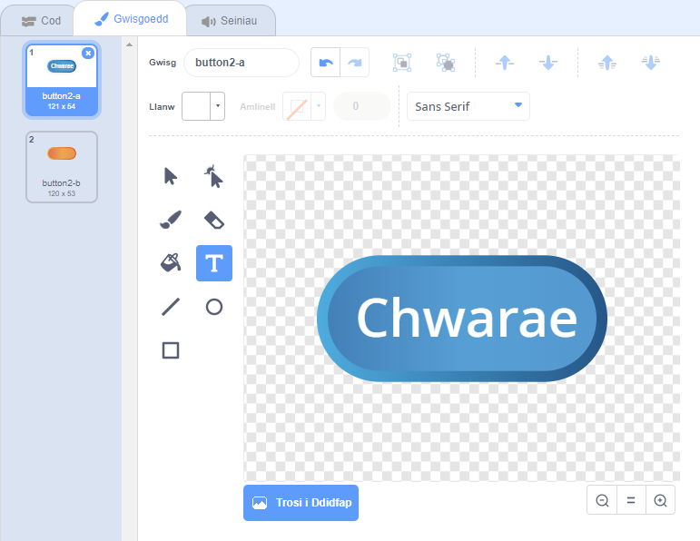
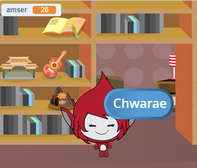

## Gemau lluosog

Fe wnawn ni ychwanegu botwm ‘chwarae’ i dy gêm fel dy fod di’n gallu chwarae sawl gwaith.

\--- task \--- Bydd angen creu corlun botwm ‘Chwarae’, sef beth fydd y chwareuwr yn clicio i ddechrau gêm newydd.

Fe alli di ei lunio dy hunan, neu olygu corlun o lyfrgell Scratch.



\--- /task \---

\--- task \--- Ychwanega'r côd yma i gorlun dy fotwm:


```blocks3
    when flag clicked
    show

    when this sprite clicked
    hide
    broadcast (start v)
```

\--- /task \---

Mae'r côd newydd yma yn cynnwys bloc arall `darlledu`{:class="block3events"}, sydd yn anfon neges i 'ddechrau'.

Mae'r côd newydd yn gwneud i'r corlun 'Chwarae' ymddangos pan mae'r chwareuwr yn clicio ar y faner. Pan fydd y botwm yn cael ei glicio, fe fydd yn cuddio a darlledu neges fydd yn cychwyn y gêm.

Ar hyn o bryd, mae'r cymeriad yn gofyn cwestiynau pan mae'r chwareuwr yn clicio ar y faner. Bydd angen i ti olygu côd dy gymeriad fel bod y gêm yn cychwyn pan mae’n derbyn neges `dechrau`{:class="block3events"}.

\--- task \--- Dewisa dy gymeriad, ac yn yr adran gôd, ailosoda `pan fo baner wedi ei glicio`{:class="block3events"} gyda `pan dderbyniaf dechrau`{:class="block3events"}.


```blocks3
<br />- when flag clicked
+ when I receive [start v]
set [number 1 v] to (pick random (2) to (12))
set [number 2 v] to (pick random (2) to (12))
ask (join (number 1)(join [ x ] (number 2))) and wait
if &lt;(answer) = ((number 1)*(number 2))&gt; then
    say [yes! :)] for (2) seconds
else
    say [nope :(] for (2) seconds
end
```

\--- /task \---

\--- task \---

Clicia’r faner werdd ac yna clicia dy fotwm 'chwarae' newydd i’w brofi. Ni ddylai’r gêm gychwyn tan fod y botwm yn cael ei glicio.

\--- /task \---

A wnes di sylwi fod yr amserydd yn cychwyn pan mae’r faner werdd wedi ei chlicio, ond nid pan mae’r gêm yn cychwyn?



\--- task \---

Alli di newid y côd yr amserydd fel fod yr amserydd yn cychwyn pan mae'r chwareuwr yn clicio ar y botwm?

\--- /task \---

Fe alli di nawr ychwanegu côd i dy fotwm i’w ddangos eto ar ddiwedd pob gêm.


```blocks3
    when I receive [end v]
    show
```

\--- /task \---

\--- task \---

Profa dy fotwm 'chwarae' trwy chwarae cwpwl o gemau. Fe ddyle ti sylwi fod y botwm chwarae yn dangos ar ôl pob gêm.

I wneud y profi yn gynt, fe alli di leihau pob gêm trwy newid gwerth yr `amser`{:class="block3variables"} fel fod pob gêm ond yn para rhai eiliadau.


```blocks3
    set [time v] to [10]
```

\--- /task \---

\--- task \--- Fe alli di newid sut mae'r botwm yn edrych pan mae'r llygoden arno.


```blocks3
    when flag clicked
    show
    forever
    if <touching (mouse-pointer v)?> then
        set [fisheye v] effect to (30)
    else
        set [fisheye v] effect to (0)
    end
    end
```

 \--- /task \---