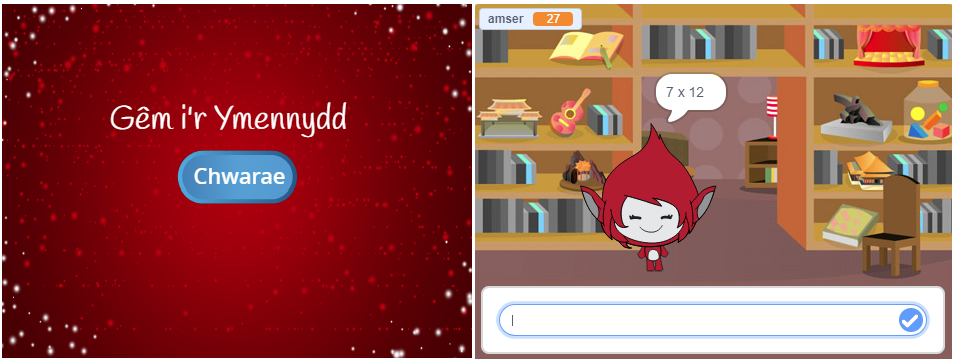

## Her: creu sgrin gychwynnol

Wyt ti’n gallu ychwanegu cefndir arall i dy lwyfan ar gyfer dechrau’r gêm?

Fe alli di ddefnyddio blociau `pan dderbyniaf dechrau`{:class="block3events"} a `pan dderbyniaf diwedd`{:class="block3events"} i newid rhwng cefndiroedd.

Fe alli di hefyd ddangos a chuddio dy gymeriad, a hyd yn oed dangos a chuddio dy amserydd yn defnyddio’r blociau yma `dangos`{:class="block3looks"} a `cuddio`{:class="block3looks"}.

I ddangos neu guddio amserydd a sgôr pan mae'r gêm yn newid rhwng cefndiroedd, mae modd defnyddio blociau `dangos newidyn`{:class="block3variables"} a `cuddio newidyn`{:class="block3variables"}.

