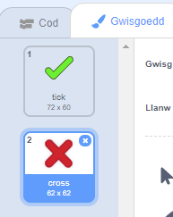
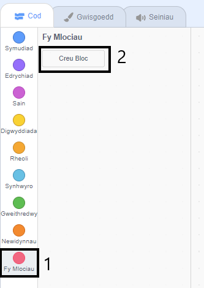
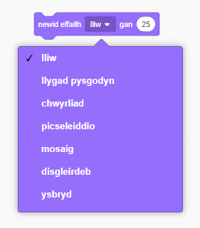

## Ychwanegu graffeg

Yn lle bod dy gymeriad ond yn dweud `ie! :)` neu `na :(`, beth am ychwanegu peth graffeg fel bod y chwareuwr yn gwybod os yw'r ateb yn gywir neu anghywir.

--- task ---

Bydd angen creu corlun newydd o’r enw ‘Canlyniad’, yn cynnwys gwisg ‘tic’ a ‘chroes’.



--- /task ---

--- task ---

Newida côd dy gymeriad, fel ei fod yn `darlledu`{:class="block3events"} negeseuon 'cywir' ac 'anghywir'.


```blocks3
os <(ateb) = ((rhif 1) * (rhif 2))> yna 
-  dweud [Ie! :)] am (2) eiliad
+ darlledu (correct v)
fel arall 
-  dweud [Na :(] am (2) eiliad
+ darlledu (wrong v)
end
```

--- /task ---

--- task ---

Fe alli di nawr ddefnyddio’r negeseuon yma i `ddangos`{:class="block3looks"} y wisg ‘tic’ neu ‘groes’. Ychwanega’r côd yma i dy gorlun ‘Canlyniad’:


```blocks3
pan rwy'n derbyn [correct v]
newid gwisg i (tick v)
dangos
aros (1) eiliad
cuddio

pan rwy'n derbyn [wrong v]
newid gwisg i (cross v)
dangos
aros (1) eiliad
cuddio

pan fo'r flag werdd yn cael ei glicio
cuddio
```

--- /task ---

--- task --- Profa dy gêm eto. Fe ddyle ti weld tic pan gei di ateb yn gywir, a chroes pan gei di ateb yn anghywir!


--- /task ---

Wyt ti wedi sylwi fod y côd `pan dderbyniaf cywir`{:class="block3events"} a `pan dderbyniaf anghywir`{:class="block3events"} bron yn union yr un peth?

Fe wnawn ni greu gweithred i wneud hi’n hawdd i ti wneud newidiadau i dy gôd.

--- task ---

Dewisa'r corlun 'Canlyniad'. Clicia `Mwy o flociau`{:class="block3myblocks"} yna **Creu Bloc**. Bydd angen creu bloc newydd o’r enw `animeiddio`{:class="block3myblocks"}.




--- /task ---

--- task --- Symuda'r côd i `ddangos`{:class="block3looks"} a `chuddio`{:class="block3looks"} y 'Canlyniad' yn y bloc `animeiddio`{:class="block3myblocks"}:


```blocks3
diffinio animeiddio
dangos
aros (1) eiliad
cuddio
```

--- /task ---

--- task --- Sicrha dy fod wedi tynnu'r blociau `dangos`{:class="block3looks"} a `chuddio`{:class="block3looks"} o dan **y ddau floc** o'r `newid gwisgoedd`{:class="block3looks"}.

Yna ychwanega'r bloc `animeiddio`{:class="block3myblocks"} o dan y ddau floc `newid gwisgoedd`{:class="block3looks"}. Fe ddylai dy gôd edrych fel hyn:


```blocks3
pan rwy'n derbyn [correct v]
newid gwisg i (tick v)
animeiddio :: custom

pan rwy'n derbyn [wrong v]
newid gwisg i (cross v)
animeiddio :: custom
```

--- /task ---

Oherwydd y bloc `animeiddio`{:class="block3myblocks"}, rwyt ti ond angen gwneud un newid i dy gôd os wyt ti eisiau dangos gwisg 'Canlyniad' dy gorlun am amser llai neu hirach.

--- task ---

Newida dy gôd fel bod y wisg 'tic' neu 'groes' yn ymddangos am 2 eiliad.

--- /task ---

--- task ---

Yn hytrach na `dangos`{:class="block3looks"} a `chuddio`{:class="block3looks"} y wisg 'tic' neu 'groes', fe alli di newid dy floc`animeiddio`{:class="block3myblocks"} fel bod y wisg yn pylu mewn.


```blocks3
diffinio animate
gosod effaith [ghost v] effaith i (100)
dangos
cuddio
```

--- /task ---

Alli di wella animeiddiad y 'tic' a'r 'groes'? Fe alli di ychwanegu côd fel bod y wisg yn pylu allan hefyd, neu ddefnyddio effeithiau cŵl arall:


