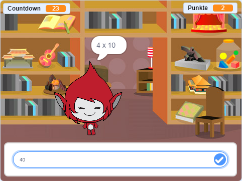

## Einleitung

In diesem Projekt lernst du, wie du ein Einmaleins-Quiz programmierst, in dem du versuchen sollst, in 30 Sekunden möglichst viele richtige Antworten zu geben.

  <iframe allowtransparency="true" width="485" height="402" src="https://scratch.mit.edu/projects/embed/42225768/?autostart=false" frameborder="0"></iframe>
  

### Additional information for club leaders

Falls du dieses Projekt ausdrucken musst, verwende bitte die [druckfreundliche Version](https://projects.raspberrypi.org/en/projects/brain-game/print).

## \--- collapse \---

## title: Anmerkungen für Clubleiter

## Einleitung:

In diesem Projekt lernen Kinder, wie sie ein Quiz mit Kopfrechnungsübungen zur Multiplikation erstellen. Ziel des Spiels ist es, in 30 Sekunden möglichst viele richtige Antworten zu geben.

## Ressourcen

Für dieses Projekt sollte Scratch 2 verwendet werden. Scratch 2 kann entweder online bei [jumpto.cc/scratch-on](http://jumpto.cc/scratch-on) verwendet werden oder unter [ jumpto.cc/scratch-off](http://jumpto.cc/scratch-off) heruntergeladen und offline benutzt werden.

Sie können eine vollständige Version dieses Projekts unter [online](http://scratch.mit.edu/projects/42225768/#editor) aufrufen oder über Klick auf den Link 'Projektmaterial' herunterladen. Dieser beinhaltet:

* BrainGame.sb2

## Lernziele

* Dieses Projekt festigt die bisher gelernten Programmierfertigkeiten und zeigt, wie die Funktion "sende... an alle" für ein einfaches Spielmenü verwendet werden kann.

Dieses Projekt deckt die folgenden Kernbereiche des [Raspberry Pi Digital Making Curriculum](http://rpf.io/curriculum) ab:

* [Problemlösung durch Kombination von Programmierstrukturen.](https://www.raspberrypi.org/curriculum/programming/builder)

## Herausforderungen

* "Kostümwechsel" - Veränderung des Aussehens der Spielfigur als Reaktion auf richtige bzw. falsche Antworten;
* "Einbau eines Punktezählers" - Hinzufügen eines Punktes zum Spielstand für jede richtige Antwort;
* "Startbildschirm" - Wechsel des Bühnenbildes in Abhängigkeit zu Spielanfang `start`{:class="blockevents"} bzw. -ende `end`{:class="blockevents"} und Senden von Nachrichten, Erstellung zweier 'Gamescreens';
* "Erweiterte Animation" - Verwendung von Schleifen und Effekten, um die graphischen Animationen bei richtigen/falschen Antworten zu verbessern;
* "Töne und Musik" - Festigung des Wissens über Musikloops und -effekte;
* "Erreiche 10 Punkte" - Wechsel der Spiellogik zur Gestaltung eines neuen Spielziels;
* "Anleitungsbildschirm" - Festigung der Verwendung von Nachrichten zur Erstellung eines Spielmenüs durch Hinzufügen eines neuen "Anleitungs"-Buttons und -bildschirms.

\--- /collapse \---

## \--- collapse \---

## title: Projektmaterial

## Ressourcen für Clubleiter

* [Vollständiges Scratch 2-Projekt zum Herunterladen](resources/BrainGame.sb2)
* [Vollständiges Scratch 2-Projekt online](http://scratch.mit.edu/projects/42225768/#editor)

\--- /collapse \---