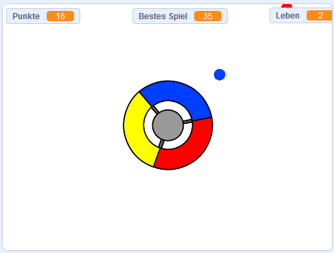

## Wie geht es weiter?

Schau dir das Projekt [Fange die Punkte](https://projects.raspberrypi.org/de-DE/projects/catch-the-dots?utm_source=pathway&utm_medium=whatnext&utm_campaign=projects) an, um herauszufinden wie man ein Reaktionsspiel erstellt! In diesem Projekt lernst du wie man Figuren klont und wie man eine Variable verwendet, um die Geschwindigkeit des Spiels schrittweise zu steigern.

--- no-print --- Verwende die Pfeiltasten deiner Tastatur um das Steuerrad zu drehen und fange die fliegenden Punkte wenn diese die Mitte erreichen. Bei drei nicht gefangenen Punkten ist das Spiel zu Ende.

  <iframe allowtransparency="true" width="485" height="402" src="https://scratch.mit.edu/projects/embed/252923761/?autostart=false" frameborder="0" scrolling="no"></iframe>
  

--- /no-print ---

--- print-only ---  --- /print-only ---

***

Dieses Projekt wurde von freiwilligen Helfern übersetzt:

Holger Wittmann

Thorsen Billib

Arnold Marko

Dank freiwilliger Helfer können wir Menschen auf der ganzen Welt die Möglichkeit geben, in ihrer eigenen Sprache zu lernen. Du kannst uns helfen, mehr Menschen zu erreichen, indem Du dich freiwillig zum Übersetzen meldest - weitere Informationen unter [rpf.io/translate](https://rpf.io/translate).