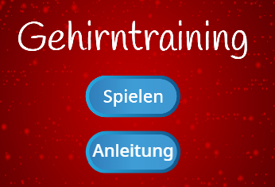

\--- challenge \---

## Aufgabe: Anleitung

Kannst du eine Anleitungs-Bildschirm zu deinem Spiel hinzufügen, indem du den Spieler erklärst, wie man dein Spiel spielt? Du wirst einen 'Anleitung'-Knopf brauchen, und einen anderen Bühnenhintergrund.



Du wirst vielleicht auch einen 'zurück'-Knopf brauchen, um dich wieder zum Hauptmenü zu bringen.

```blocks
    broadcast [main menu v]
```

\--- /challenge \---