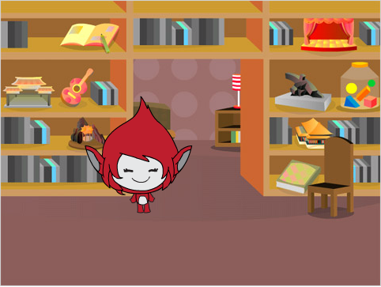
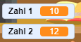

## Aufgaben erzeugen

Beginnen wir damit, zufällige Fragen zu erzeugen, die der Spieler beantworten soll.

+ Starte ein neues Scratch-Projekt und lösche die Katzenfigur. Dein Projekt ist nun leer. Du findest den Online-Editor für Scratch unter <a href="http://jumpto.cc/scratch-new" target="_blank">jumpto.cc/scratch-new</a>.

+ Wähle eine Figur und einen Bühnenhintergrund für dein Spiel. Du kannst selbst entscheiden welche dir gefallen! Hier ein Beispiel:
    
    

+ Erstelle 2 neue Variablen mit den Namen `Zahl 1`{:class="blockdata"} und `Zahl 2`{:class="blockdata"}. Diese beiden Variablen speichern die beiden Zahlen, die miteinander multipliziert werden sollen.
    
    

+ Füge deiner Spielfigur Programmcode hinzu, sodass beide Variablen eine `Zufallszahl`{:class="blockoperators"}zwischen 2 und 12 zugewiesen bekommen.
    
    ```blocks
        Wenn die grüne Flagge angeklickt
    setze [Zahl 1 v] auf (Zufallszahl von (2) bis (12))
    setze [Zahl 2 v] auf (Zufallszahl von (2) bis (12))
    ```

+ Du kannst nun deinen Spieler nach der Antwort fragen und ihn wissen lassen. ob seine richtig oder falsch ist.
    
    ```blocks
        Wenn die grüne Flagge angeklickt
    setze [zahl 1 v] auf (Zufallszahl von (2) bis (12))
    setze [zahl 2 v] auf (Zufallszahl von (2) bis (12))
    frage (verbinde (Zahl 1)(verbinde [x] (Zahl 2))) und warte
    falls <(Antwort) = ((Zahl 1)*(Zahl 2))> dann
    sage [Richtig! :)] für (2) Sek.
    sonst
    sage [Falsch! :(] für (2) Sek.
    end
    ```

+ Teste dein Projekt vollständig, indem du einmal die richtige und einmal eine falsche Lösung eingibst.

+ Lege um diesen Code eine `Wiederhole fortlaufend`-Schleife, damit der Spieler jede Menge Aufgaben gestellt bekommt.

+ Richte auf der Bühne einen Countdown-Timer ein, und zwar mithilfe einer Variablen namens `Zeit`{:class="blockdata"}. Falls du Hilfe brauchst: Das Ghostbuster-Projekt beinhaltet (in Schritt 5) eine Anleitung zur Erstellung eines Timers!

+ Teste dein Projekt nochmals - du solltest nun solange Fragen gestellt bekommen, bis die Zeit abgelaufen ist.