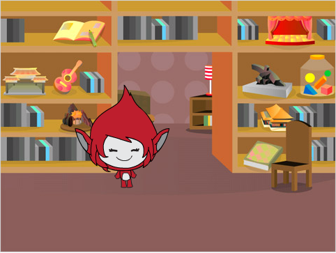
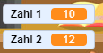

## Fragen erstellen

Beginnen wir damit, zufällige Fragen zu erstellen, auf die der Spieler antworten muss.

--- task ---

Erstelle ein neues Scratch-Projekt.

**Online:** öffne ein neues Online Scratch Projekt über [rpf.io/scratch-new](https://rpf.io/scratch-new){:target="_blank"}.

**Offline:** Öffne ein neues Projekt im Scratch Offline Editor.

Wenn du den Scratch Offline Editor herunterladen und installieren möchtest, findest du diesen unter [rpf.io/scratchoff](https://rpf.io/scratchoff){:target="_blank"}.

--- /task ---

--- task ---

Wähle eine Figur und einen Bühnenbild für dein Spiel. Du kannst selbst entscheiden welche dir gefallen! Hier ein Beispiel:



--- /task ---

--- task ---

Achte darauf, dass du deine Figur ausgewählt hast. Erstelle zwei neue Variablen und bennene sie `Zahl 1`{:class="block3variables"} und `Zahl 2`{:class="block3variables"}, um die Werte für deine Quizfragen zu speichern.




[[[generic-scratch3-add-variable]]]

--- /task ---

--- task ---

Füge deiner Figur Code hinzu, damit beiden `Variablen`{:class="block3variables"} eine `Zufallszahl`{:class="block3operators"} zwischen 2 und 12 zugeordnet wird.


```blocks3
when flag clicked
set [Zahl 1 v] to (pick random (2) to (12))
set [Zahl 2 v] to (pick random (2) to (12))
```

--- /task ---

--- task ---

Füge Code hinzu, um den Spieler nach der Antowrt zu `fragen`{:class="block3sensing"} und dann `für 2 Sekunden sagt`{:class="block3looks"}, ob die Antwort richtig oder falsch war:


```blocks3
when flag clicked
set [Zahl 1 v] to (pick random (2) to (12))
set [Zahl 2 v] to (pick random (2) to (12))
+ ask (join (number 1) (join [ x ] (number 2))) and wait
+ if <(answer) = ((Zahl 1) * (Zahl 2))> then
+ say [Genau! :)] for (2) seconds
+ else 
+ say [Nein :(] for (2) seconds
```

--- /task ---

--- task ---

Überprüfe dein Projekt in dem du die Frage einmal richtig und einmal falsch beantwortest.

--- /task ---

--- task ---

Füge eine `wiederhole fortlaufend` Schleife um diesen Code, sodass dem Spieler eine Menge Fragen hintereinander gestellt werden.

--- hints ---

--- hint ---

Du musst einen `wiederhole fortlaufend`{:class="block3control"} Programmblock hinzufügen und den gesamten Code außer `wenn Fahne angeklickt wird`{:class="block3control"} in diese Schleife stellen.

--- /hint ---

--- hint ---

Hier sind die Code Blöcke die du brauchst:

```blocks3
forever
end
```

--- /hint ---

--- hint ---

So sollte dein Code Block aussehen:

```blocks3
when flag clicked
+ forever 
  set [Zahl 1 v] to (pick random (2) to (12))
  set [Zahl 2 v] to (pick random (2) to (12))
  ask (join (Zahl 1) (join [ x ] (Zahl 2))) and wait
  if <(answer) = ((Zahl 1) * (Zahl 2))> then 
    say [Genau! :)] for (2) seconds
  else 
    say [Nein :(] for (2) seconds
  end
end
```

--- /hint --- --- /hints ---

--- /task ---
