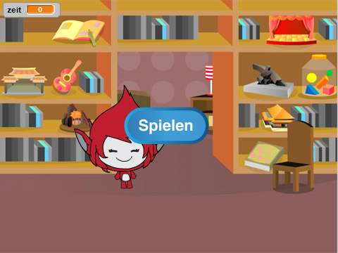
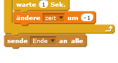
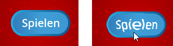

## Mehrmals spielen

Lass uns einen 'spielen' Knopf zu deinem Spiel hinzufügen, damit du es mehrmals spielen kannst.

+ Erstelle eine neue 'spielen' Figur, welche der Spieler anklicken muss, um ein neues Spiel zu starten. Du kannst die Figur selber malen, oder eine Figur aus der Scratch Bibliothek berabeiten.
    
    

+ Füge diesen Code zu deinem Knopf hinzu.
    
    ```blocks
        Wenn die grüne Flagge angeklickt
        zeige dich
    
        Wenn ich angeklickt werde
        verstecke dich
        sende [Start v] an alle
    ```
    
    Dieser Code zeigt deinen Spielen-Knopf, wenn dein Projekt gestartet wird. Wenn der Knopf angeklickt wird, wird er versteckt und sendet dann eine Nachricht, die das Spiel startet.

+ Du musst den Code deiner Spielfigur anpassen, damit das Spiel beginnt, wenn die Figur die `start`{:class="blockevents"} Startmeldung erhält, und nicht erst wenn die Flagge angeklickt wird.
    
    Ersetze den Code `Wenn die grüne Flagge angeklickt`{:class="blockevents"} mit `Wenn ich Start empfange`{:class="blockevents"}.
    
    

+ Klicke die grüne Flagge an und klicke danach auf deinen Spielen-Knopf, um ihn zu testen. Du solltest sehen, dass die Spiel nicht startet, bis der Knopf gedrückt wurde.

+ Hast du bemerkt, dass die Zeituhr startet, wenn die grüne Flagge angeklickt wird und nicht, wenn das Spiel beginnt?
    
    
    
    Kannst du das Problem lösen?

+ Klicke auf die Bühne und ersetze den `stoppe alles`{:class="blockcontrol"} Block mit einer `Ende`{:class="blockevents"} Nachricht.
    
    

+ Du kannst jetzt den Code zu deinem Knopf hinzufügen, um ihn bei Spielende erneut anzuzeigen.
    
    ```blocks
        Wenn ich [Ende v] empfange
        zeige dich
    ```

+ Du musst auch den Code deiner Spielfigur beenden, damit sie keine weiteren Fragen beim Spielende stellt:
    
    ```blocks
        Wenn ich [Ende v] empfange
        stoppe [andere Skripte der Figur v]
    ```

+ Teste deinen Spielen-Knopf, indem du ein paar Spiele spielst. Du solltest merken, dass der Spielen-Knopf nach jedem Spiel angezeigt wird. Um das Testen leichter zu machen, kannst du dein Spiel abkürzen, damit es nur ein paar Sekunden dauert.
    
    ```blocks
        setze [Zeit v] auf [10]
    ```

+ Du kannst das Aussehen des Knopfes auch ändern, wenn die Maus darüber gleitet.
    
    ```blocks
        Wenn die grüne Flagge angeklickt
        zeige dich
        wiederhole fortlaufend 
        falls <wird [Mauszeiger v] berührt?> dann
            setze [Fischauge v] -Effekt auf (30)
       sonst
            setze [Fischauge v] -Effekt auf (0)
        end
        end
    ```
    
    