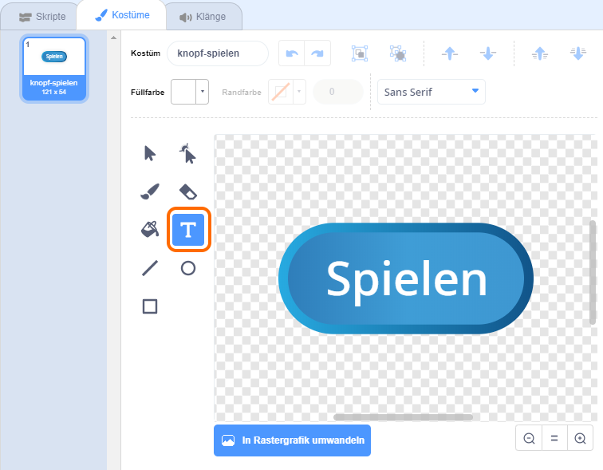
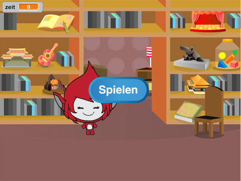
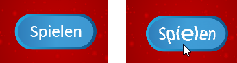

## Mehrfach spielen

Jetzt wirst du eine Taste "Spielen" hinzufügen, damit der Spieler dein Spiel mehrmals spielen kann.

--- task ---

Erstelle eine neue Figur - eine 'Spielen'-Taste, auf die der Spieler klicken muss, um ein neues Spiel zu starten.

Du kannst die Figur selbst zeichnen oder eine Figur aus der Bibliothek verwenden.



--- /task ---

--- task ---

Füge deiner Spielen Knopf Figur diesen Code hinzu:


```blocks3
when flag clicked
show

when this sprite clicked
hide
broadcast (Start v)
```

--- /task ---

Der neue Code enthält einen weiteren `sende an alle`{:class="block3events"} Block, der die Nachricht 'Start' sendet.

Der neue Code zeigt die 'Spielen' Taste, nachdem der Spieler auf die grüne Flagge klickt. Wenn der Spieler auf die Figur Spielen klickt, versteckt sich diese Figur und sendet eine Nachricht an alle anderen Figuren, damit diese darauf reagieren können.

In dem Moment, in dem die Giga-Figur die Nachricht 'Start' empfängt, fängt sie an eine Frage zu stellen. Ändere den Code des Spiels, damit die Giga Figur beginnt Fragen zu stellen, wenn es die `gesendete Nachricht`{:class="block3events"} 'Start' empfängt.

--- task ---

Wähle die Giga-Figur aus und ersetze den Code `Wenn die grüne Flagge angeklickt wird`{:class="block3events"} Block durch einen `wenn ich Start empfange`{:class="block3events"} Block.


```blocks3
- when flag clicked
+ when I receive [Start v]
set [Zahl 1 v] to (pick random (2) to (12))
set [Zahl 2 v] to (pick random (2) to (12))
ask (join (Zahl 1) (join [ x ] (Zahl 2))) and wait
if <(answer) = ((Zahl 1) * (Zahl 2))> then 
  say [Genau! :)] for (2) seconds
else 
  say [Nein :(] for (2) seconds
end
```

--- /task ---

--- task ---

Um die Änderungen zu testen, klicke auf die grüne Flagge und anschließend auf die neue Taste "Spielen". Das Spiel sollte nicht starten, bevor man auf die Schaltfläche klickt.

--- /task ---

Siehst du, dass der Countdown sofort startet, wenn die grüne Flagge geklickt wird und nicht erst, wenn die Taste "Spielen" gedrückt wird?



--- task ---

Kannst du den Code für den Coutdown ändern, damit der Countdown erst beginnt, wenn der Spieler auf die "Spielen" Taste gedrückt hat?

--- /task ---

--- task ---

Füge Code zu deiner Spielen-Knopf Figur hinzufügen, so dass die Schaltfläche am Ende jedes Spiels wieder angezeigt wird.


```blocks3
	when I receive [Ende v]
	show
```

--- /task ---

--- task ---

Teste die Taste 'Spielen', indem du ein paar Spiele spielst. Die Taste sollte am Ende jedes Spiels wieder angezeigt werden.

Um das Spiel schneller zu testen, kannst du den Wert der Variabel `Countdown`{:class="block3variables"} ändern, damit jedes Spiel nur ein paar Sekunden dauert.


```blocks3
    set [Countdown v] to [10]
```

--- /task ---

--- task ---

Du kannst das Aussehen der "Spielen" Schaltfläche ändern, wenn sich der Mauszeiger darüber befindet.


```blocks3
when flag clicked
show
forever 
  if <touching (Mauszeige v) ?> then 
    set [Fischauge v] effect to (30)
  else 
    set [Fischauge v] effect to (0)
  end
end
```



--- /task ---