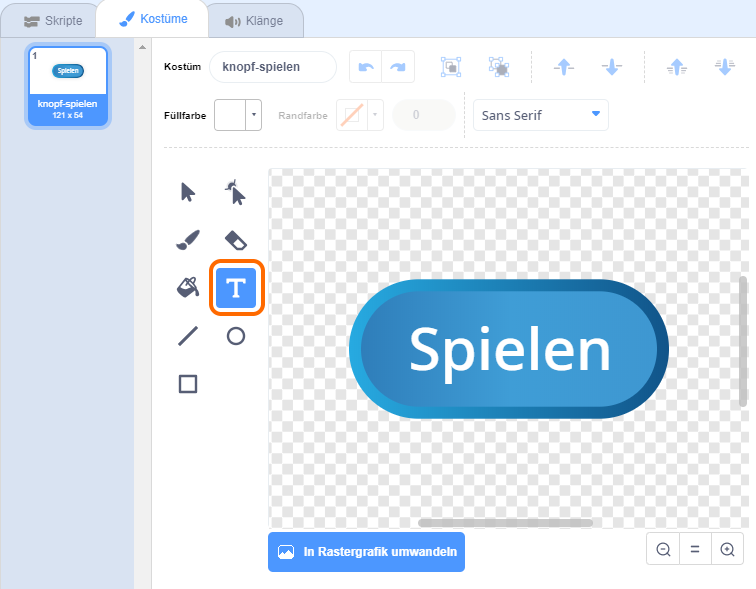

## Mehrfache Spiele

Lass uns einen 'start' Knopf zu deinem Spiel hinzufügen, damit du es mehrmals spielen kannst.

+ Create a new 'Play' button sprite, which your player will click to start a new game. You can draw it yourself, or edit a sprite from the Scratch library.
    
    

+ Add this code to your new button.
    
    ```blocks
        when flag clicked
        show
    
        when this sprite clicked
        hide
        broadcast [start v]
    ```
    
    This code shows the play button when your project is started. When the button is clicked, it is hidden and then broadcasts a message that will start the game.

+ You'll need to edit your character's code, so that the game starts when they receive the `start`{:class="blockevents"} message, and not when the flag is clicked.
    
    Replace the `when flag clicked`{:class="blockevents"} code with `when I receive start`{:class="blockevents"}.
    
    

+ Click the green flag and then click your new play button to test it. You should see that the game doesn't start until the button is clicked.

+ Did you notice that the timer starts when the green flag is clicked, and not when the game starts?
    
    
    
    Can you fix this problem?

+ Click on the stage, and replace the `stop all`{:class="blockcontrol"} block with an `end`{:class="blockevents"} message.
    
    

+ You can now add code to your button, to show it again at the end of each game.
    
    ```blocks
        when I receive [end v]
        show
    ```

+ You'll also need to stop your character asking questions at the end of each game:
    
    ```blocks
        when I receive [end v]
        stop [other scripts in sprite v]
    ```

+ Test your play button by playing a couple of games. You should notice that the play button shows after each game. To make testing easier, you can shorten each game, so that it only lasts a few seconds.
    
    ```blocks
        set [time v] to [10]
    ```

+ You can even change how the button looks when the mouse hovers over it.
    
    ```blocks
        when flag clicked
        show
        forever
        if <touching [mouse-pointer v]?> then
            set [fisheye v] effect to (30)
        else
            set [fisheye v] effect to (0)
        end
        end
    ```
    
    