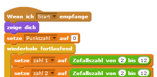

## Mehrmals spielen

Lass uns einen "Spielen"-Knopf zu deinem Spiel hinzufügen, damit du es mehrmals nacheinander spielen kannst.

+ Mache eine neue 'spielen' Figur, welche der Spieler anklicken muss, um ein neues Spiel zu starten. Du kannst die Figur selber entwerfen, oder eine aus der Scratch-Bibliothek bearbeiten.
    
    

+ Füge diesen Code zu deinem Knopf hinzu.
    
    ```blocks
        Wenn die grüne Flagge angeklickt
    zeige dich
    
    Wenn ich angeklickt werde
    verstecke dich
    sende [Start v] an alle
    ```
    
    Dieser Code zeigt den Spielen-Knopf, wenn dein Projekt gestartet wird. Wenn der Knopf angeklickt wird, wird er versteckt und sendet dann eine Meldung, die das Spiel startet.

+ Du musst den Code deiner Spielfigur so anpassen, dass das Spiel beginnt, wenn die Figur die `Start`{:class="blockevents"}-Meldung erhält und nicht, wenn die grüne Flagge angeklickt wird.
    
    Ersetze den Code `Wenn die grüne Flagge angeklickt`{:class="blockevents"} durch `Wenn ich Start empfange`{:class="blockevents"}.
    
    

+ Klicke die grüne Flagge an und klicke danach auf deinen Spielen-Knopf, um ihn zu testen. Du solltest sehen, dass das Spiel nicht beginnt, bis der Knopf gedrückt wurde.

+ Hast du bemerkt, dass die Zeituhr startet, wenn die grüne Flagge angeklickt wird und nicht, wenn das Spiel beginnt?
    
    
    
    Kannst du dieses Problem lösen?

+ Klicke auf die Bühne und ersetze den `stoppe alles`{:class="blockcontrol"}-Block mit einer `Ende`{:class="blockevents"}-Nachricht.
    
    

+ Du kannst jetzt den Code für deinen Knopf schreiben, damit er bei Spielende erneut angezeigt wird.
    
    ```blocks
        Wenn ich [end v] empfange
    zeige dich
    ```

+ Außerdem musst du deine Spielfigur daran hindern, nach Spielende immer weiter Fragen zu stellen:
    
    ```blocks
        Wenn ich [Ende v] empfange
    stoppe [andere Skripte der Figur v]
    ```

+ Teste deinen Spielen-Knopf, indem du ein paar Spiele spielst. Du solltest sehen, dass sich der Spielen-Knopf nach jedem Spiel zeigt. Um das Testen leichter zu machen, kannst du die Spielrunden verkürzen, damit sie nur ein paar Sekunden dauern.
    
    ```blocks
        setze [zeit v] auf [10]
    ```

+ Du kannst das Aussehen des Knopfes auch ändern, wenn die Maus darüber gleitet.
    
    ```blocks
        Wenn die grüne Flagge angeklickt
    zeige dich
    wiederhole fortlaufend 
      falls <touching [mouse-pointer v]?> dann 
        setze [Fischauge v] -Effekt auf (30)
      
        setze [Fischauge v] -Effekt auf (0)
      end
    end
    ```
    
    