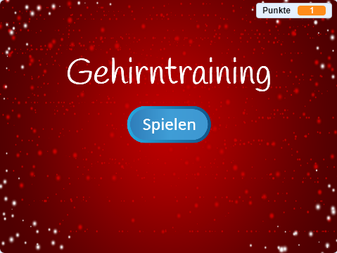

\--- challenge \---

## Herausforderung: Startbildschirm

Kannst du einen weiteren Hintergrund zu deiner Bühne hinzufügen, welcher der Start-Bildschirm deines Spiels sein wird? Du kannst die `Wenn ich Start empfange`{:class="blockevents"} und `Wenn ich Ende empfange`{:class="blockevents"} Blöcke verwenden, um zwischen den Hintergründen zu wechseln.

Mit Hilfe dieser Blöcke kannst du sogar deine Spielfigur und deine Zeituhr entweder anzeigen oder auch verstecken:

```blocks
zeige Variable [zeit v]
```

```blocks
verstecke Variable [zeit v]
```



\--- /challenge \---