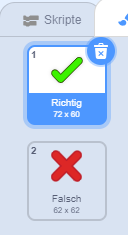
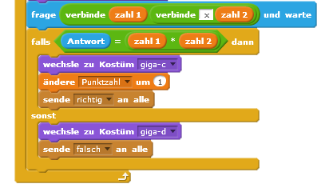
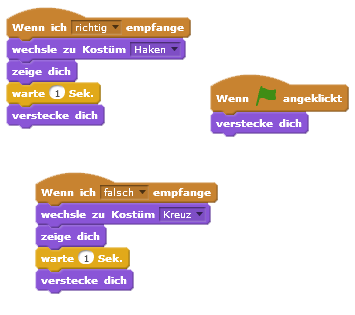
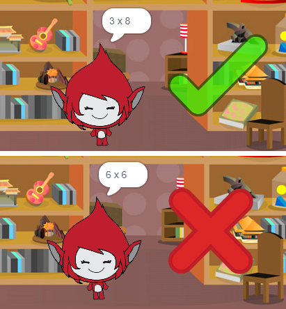
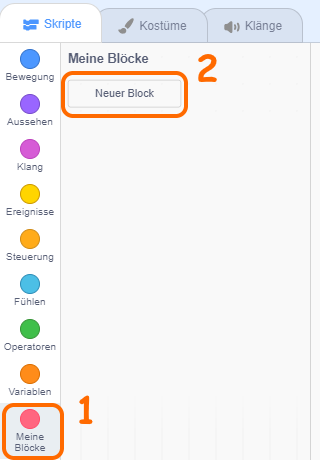
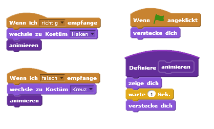

## Grafiken hinzufügen

Anstatt deine Spielfigur nur `Genau! :)` oder `Nö :(` zum Spieler sagen zu lassen, können wir jetzt Grafik benutzen, damit der Spieler weiß, wie er dasteht.

+ Erstelle eine neue Figur namens Ergebnis, die sowhol ein "Häkchen" als auch ein "Kreuz" Kostüm enthält.
    
    

+ Ändere den Code deiner Spielfigur, damit du, statt nur dem Spieler mitzuteilen, welchen Punktzahl er erreicht hat, ihm statt dessen auch die entsprechenden `richtig`{:class="blockevents"} und `falsch`{:class="blockevents"} Nachrichten senden kannst.
    
    

+ Du kannst jetzt diese Meldungen dazu benutzen, um entweder das "Häkchen" oder das "Kreuz" Kostüm anzuzeigen. Füge diesen Code zu deiner neuen Ergbnis Figur hinzu:
    
    

+ Teste dein Spiel erneut. Du solltest jedes mal, wenn du eine Frage richtig beantwortet hast, ein Häkchen sehen oder, wenn du die Frage falsch beantwortet hast, ein Kreuz sehen!
    
    

+ Hast du bemerkt, dass der Code für die `Wenn ich richtig empfange`{:class="blockevents"} und `Wenn ich falsch empfange`{:class="blockevents"} Blöcke nahezu identisch ist? Lass uns eine Funktion erstellen, damit es leichter für dich ist, Änderungen an deinem Code vorzunehmen.
    
    Klicke auf `Weitere Blöcke`{:class="blockmoreblocks"} auf deiner Ergebnis Figur und dann auf 'Neuer Block'. Erstelle eine neue Funktion namens `animieren`{:class="blockmoreblocks"}.
    
    

+ Du kannst den Animationscode zu deiner neuen animieren-Funktion hinzufügen und dann die Funktion zweimal benutzen:
    
    

+ Jetzt musst du nur eine Veränderung an deinem Code vornehmen, wenn du das Häkchen und das Kreuz für längere oder kürzere Zeit anzeigen möchtest. Probier es mal!

+ Anstatt das Häkchen und das Kreuz nur zu zeigen oder zu versteckene, kannst du auch die animieren-Funktion ändern, damit die Grafik eingeblendet wird.
    
    ```blocks
        Definiere (animieren)
        setze [Durchsichtigkeit v] -Effekt auf (100)
        zeige dich
        wiederhole (25) mal 
             ändere [Durchsichtigkeit v] -Effekt um (-4)
        end
        verstecke dich
    ```