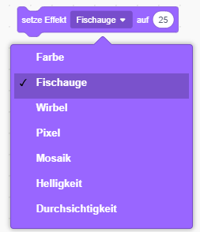

## Grafiken hinzufügen

Im Moment sagt die Giga-Figur nur `Genau! :)` oder `nein :(` als Reaktion auf die Antworten des Spielers. Füge ein Paar Grafiken hinzu die zeigen, ob die Antwort richtig oder falsch ist.

--- task ---

Erstelle eine neue Figur namens "Ergebnis", die sowohl ein "grünes Häkchen" als auch ein "rotes Kreuz" Kostüm enthält.


--- /task ---

--- task ---

Ändere den Code der Giga-Figur so, dass sie, anstatt etwas zum Spieler zu sagen, eine `Nachricht sendet`{:class="block3events"}, mit dem Inhalt "Richtig" oder "Falsch".


```blocks3
falls <(Antwort) = ((Zahl 1) * (Zahl 2))> , dann 
- sage [Genau! :)] für (2) Sekunden
+ sende (Richtig v) an alle
sonst 
- sage [nein :(] für (2) Sekunden
+ sende (Falsch v) an alle
```

--- /task ---

--- task ---

Du kannst nun diese Nachrichten verwenden, um zum entsprechenden Richtig oder Falsch `Kostüm zu wechseln`{:class="block3looks"}. Füge der Figur "Ergenbis" den folgenden Code hinzu:


```blocks3
    Wenn ich [Richtig v] empfange
    wechsle zu Kostüm (Richtig v)
    zeige dich
    warte (1) Sekunden
    verstecke dich

    Wenn ich [Falsch v] empfange
    wechsle zu Kostüm (Falsch v)
    zeige dich
    warte (1) Sekunden
    verstecke dich

    Wenn die grüne Flagge angeklickt
    verstecke dich
```

--- /task ---

--- task --- Teste dein Spiel erneut. Du solltest den grünen OK Haken sehen, wenn du eine Frage richtig beantwortest, und das rote Flasch Kreuz, wenn du falsch antwortest!


--- /task ---

Hast du bemerkt, dass die Codes für `Wenn ich Richtig empfange`{:class="blockevents"} und `Wenn ich Falsch empfange`{:class="blockevents"} nahezu identisch sind?

Damit du deinen Code einfacher ändern kannst, wirst du einen benutzerdefinierten Block erstellen.

--- task ---

Wählen die Figur "Ergebnis" aus. Anschließend klicke auf `Meine Blöcke`{:class="block3myblocks"}, und dann noch auf **Neuer Block**. Erstelle einen neuen Block und nenne ihn `animieren`{:class="block3myblocks"}.


--- /task ---

--- task --- Verschiebe den Code `zeige dich`{:class="block3looks"} und `verstecke dich`{:class="block3looks"} aus der 'Ergebnis' Figur in den `animiere`{:class="block3myblocks"} Block:


```blocks3
Definiere animiere
zeige dich
warte (1) Sekunden
verstecke dich
```

--- /task ---

--- task --- Stelle sicher, dass die `zeige dich`{:class="block3looks"} und `verstecke dich`{:class="block3look"} Blöcke unter **beiden** `wechsle zu Kostüm`{:class="block3looks"} Blöcken entfernt sind.

Füge anschließend den neuen `animiere`{:class="block3myblocks"} Block unter die beiden Blöcken `wechsle zu Kostüm`{:class="block3look"} hinzu. Dein Code sollte nun so aussehen:


```blocks3
    Wenn ich [Richtig v] empfange
    wechsle zu Kostüm (Richtig v)
    animiere:: custom

    Wenn ich [Falsch v] empfange
    wechsle zu Kostüm (Falsch v)
    animiere:: custom
```

--- /task ---

Der Vorteil des benutzerdefinierten Block `animieren`{:class="block3myblocks"} ist, dass jede Änderung am Code nur noch einmal vorgenommen werden muss, wenn beispielsweise die 'Ergebnis' Figur länger oder kürzer angezeigt werden soll.

--- task ---

Ändere deinen Code so, dass die Kostüme 'Richtig' oder 'Falsch' für 2 Sekunden angezeigt werden.

--- /task ---

--- task --- Anstatt das "Richtig" oder "Falsch" Kostüm `zeigen`{:class="block3looks"} und `verstecken`{:class="block3looks"}, kannst du den `animiere`{:class="block3myblocks"} Block ändern, so dass die Kostüme ein- und ausblenden.


```blocks3
    Definiere animiere
    setze Effekt [Durchsichtigkeit v] auf (100)
    zeige dich
    wiederhole (25) mal
        ändere Effekt [Durchsichtigkeit v] um (-4)
    verstecke dich
```

--- /task ---

Kannst du die Animation der 'Richtig' oder 'Falsch'-Grafiken verbessern? Du kannst Code hinzufügen, um die Kostüme auch auszublenden, oder du kannst andere coole Effekte verwenden:

