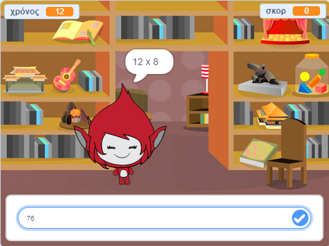

## Εισαγωγή

Σε αυτό το έργο θα μάθετε πώς μπορείτε να δημιουργήσετε ένα κουίζ δοκιμής χρόνου, στο οποίο θα πρέπει να λάβετε όσο το δυνατόν περισσότερες απαντήσεις όσο μπορείτε μέσα σε 30 δευτερόλεπτα.

  <iframe allowtransparency="true" width="485" height="402" src="https://scratch.mit.edu/projects/embed/42225768/?autostart=false" frameborder="0"></iframe>
  

### Πρόσθετες πληροφορίες για τους ηγέτες των ομάδων

Αν χρειαστεί να εκτυπώσετε αυτό το έργο, παρακαλούμε χρησιμοποιήστε την έκδοση [φιλική προς εκτύπωση](https://projects.raspberrypi.org/en/projects/brain-game/print).

## \--- κατάρρευση \---

## τίτλος: Σημειώσεις αρχηγού συλλόγου

## Εισαγωγή:

Σε αυτό το πρόγραμμα, τα παιδιά θα μάθουν πώς να κάνουν ένα παιχνίδι κουίζ χρονικών πινάκων, στο οποίο ο παίκτης πρέπει να απαντήσει σε όσες ερωτήσεις σωστά όσο μπορούν μέσα σε 30 δευτερόλεπτα.

## Πόροι

Για το έργο αυτό, θα πρέπει να χρησιμοποιηθεί το Scratch 2. Το Scratch 2 μπορεί είτε να χρησιμοποιηθεί online στο [jumpto.cc/scratch-on](http://jumpto.cc/scratch-on) είτε να το κατεβάσει από [jumpto.cc/scratch-off](http://jumpto.cc/scratch-off) και να χρησιμοποιηθεί εκτός σύνδεσης.

Μπορείτε να βρείτε μια ολοκληρωμένη έκδοση αυτού του έργου [online](http://scratch.mit.edu/projects/42225768/#editor)ή μπορείτε να το κατεβάσετε κάνοντας κλικ στο σύνδεσμο «Υλικό έργου» για αυτό το έργο, το οποίο περιέχει:

* BrainGame.sb2

## Στόχοι μάθησης

* Αυτό το έργο εδραιώνει την εκμάθηση προηγούμενων δεξιοτήτων προγραμματισμού και δείχνει πώς μπορούν να χρησιμοποιηθούν οι εκπομπές για να δημιουργηθεί ένα απλό σύστημα μενού παιχνιδιών.

Αυτό το έργο καλύπτει στοιχεία από τις ακόλουθες πτυχές του [Raspberry Pi Ψηφιακή Κάνοντας το Αναλυτικό Πρόγραμμα](http://rpf.io/curriculum):

* [Συνδυάστε δομές προγραμματισμού για να λύσετε ένα πρόβλημα.](https://www.raspberrypi.org/curriculum/programming/builder)

## Προκλήσεις

* "Αλλαγή κοστουμιών" - αλλαγή του τρόπου εμφάνισης του χαρακτήρα παιχνιδιού σε απάντηση σε σωστές και λανθασμένες απαντήσεις.
* "Προσθήκη βαθμολογίας" - προσθέτοντας ένα σημείο για κάθε σωστή ερώτηση που απαντήθηκε.
* "Οθόνη Start" - αλλάζοντας το στάδιο σκηνικό σε απόκριση του `έναρξης`{: class = "blockevents"} και `άκρο`{: class = "blockevents"} μηνύματα εκπομπής, δημιουργώντας 2 παιχνίδι 'οθόνες'?
* "Βελτιωμένη κινούμενη εικόνα" - χρησιμοποιώντας βρόχους και εφέ για τη βελτίωση της ορθής / λανθασμένης κίνησης γραφικών.
* "Ήχος και μουσική" - εδραιώνοντας την εκμάθηση μουσικών βρόχων και ηχητικών εφέ.
* "Αγωνιστείτε σε 10 πόντους" - αλλάζοντας τη λογική του παιχνιδιού για να δημιουργήσετε ένα νέο στόχο παιχνιδιού.
* "Οθόνη εντολών" - ενοποίηση της χρήσης εκπομπών για τη δημιουργία μενού παιχνιδιού, με την προσθήκη ενός νέου κουμπιού και οθόνης "οδηγίες".

\--- /κατάρρευση \---

## \--- κατάρρευση \---

## τίτλος: Υλικό του έργου

## Πόροι αρχηγού συλλόγου

* [Λήψη ολοκληρωμένου έργου Scratch 2](resources/BrainGame.sb2)
* [Online πρόγραμμα ολοκλήρωσης Scratch 2](http://scratch.mit.edu/projects/42225768/#editor)

\--- /κατάρρευση \---