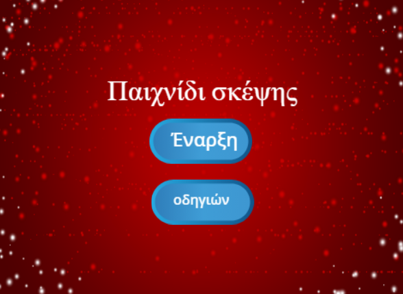

\--- challenge \---

## Πρόκληση: Οθόνη οδηγιών

Μπορείς να προσθέσεις μια οθόνη οδηγιών στο παιχνίδι σου, που να λέει στον παίκτη σου πώς να παίξει το παιχνίδι; Θα χρειαστείς ένα κουμπί "Instructions" (Οδηγίες) και ένα άλλο φόντο για το σκηνικό.



Ενδέχεται επίσης να χρειαστείς ένα κουμπί 'Back' (Επιστροφή) για να μεταβείς στο κύριο μενού.

```blocks
    broadcast [main menu v]
```

\--- /challenge \---