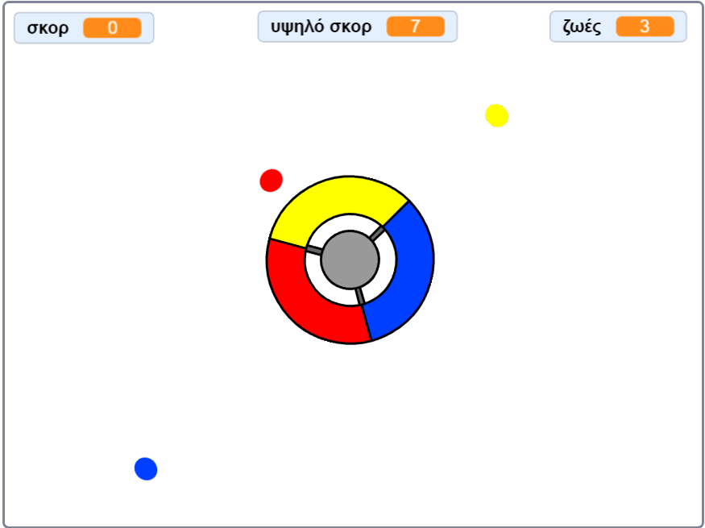

## Και τώρα;

Δοκίμασε το έργο [Πιάσε τις τελείες](https://projects.raspberrypi.org/en/projects/catch-the-dots?utm_source=pathway&utm_medium=whatnext&utm_campaign=projects), για να δημιουργήσεις το δικό σου παιχνίδι αντανακλαστικών! Σε αυτό το έργο, θα μάθεις πώς να δημιουργείς αντίγραφα των αντικειμένων, και πώς να χρησιμοποιήσεις μια μεταβλητή για να επιταχύνεις σταδιακά το παιχνίδι.

\--- no-print \--- Χρησιμοποίησε τα βελάκια του πληκτρολογίου για να περιστρέψεις το χειριστήριο και να πιάσεις τις ιπτάμενες τελείες καθώς πλησιάζουν το κέντρο. Αν χάσεις τρεις τελείες, το παιχνίδι τελειώνει.

  <iframe allowtransparency="true" width="485" height="402" src="https://scratch.mit.edu/projects/embed/252923761/?autostart=false" frameborder="0" scrolling="no"></iframe>
  

\--- /no-print \---

\--- print-only \---  \--- /print-only \---