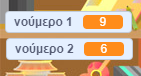

## Δημιουργία ερωτήσεων

Ας ξεκινήσουμε δημιουργώντας τυχαίες ερωτήσεις για να απαντήσει ο παίκτης.

+ Ξεκίνησε ένα νέο έργο Scratch και διέγραψε το αντικείμενο (sprite) της γάτας έτσι ώστε το έργο να είναι άδειο. Μπορείς να βρεις τον online επεξεργαστή Scratch στο <a href="http://jumpto.cc/scratch-new" target="_blank">jumpto.cc/scratch-new</a>.

+ Επίλεξε έναν χαρακτήρα και ένα σκηνικό για το παιχνίδι σου. Μπορείς να επιλέξεις ότι σου αρέσει! Ακολουθεί ένα παράδειγμα:
    
    

+ Δημιούργησε 2 νέες μεταβλητές που ονομάζονται `number 1`{: class = "blockdata"} (αριθμός 1) και `number 2`{: class = "blockdata"} (αριθμός 2). Αυτές οι μεταβλητές θα αποθηκεύσουν τους 2 αριθμούς που θα πολλαπλασιαστούν μαζί.
    
    

+ Πρόσθεσε τον κώδικα στον χαρακτήρα σου, ώστε να ορίσεις και για τις δύο αυτές μεταβλητές μία `τυχαία`{: class = "blockoperators"} τιμή μεταξύ 2 και 12.
    
    ```blocks
        when flag clicked
        set [number 1 v] to (pick random (2) to (12))
        set [number 2 v] to (pick random (2) to (12))
    ```

+ Στη συνέχεια, μπορείς να ζητήσεις από τον παίκτη την απάντηση και να τον ενημερώσεις εάν ήταν σωστή ή λανθασμένη.
    
    ```blocks
        when flag clicked
        set [number 1 v] to (pick random (2) to (12))
        set [number 2 v] to (pick random (2) to (12))
        ask (join (number 1)(join [ x ] (number 2))) and wait
        if <(answer) = ((number 1)*(number 2))> then
            say [yes! :)] for (2) secs
        else
            say [nope :(] for (2) secs
        end
    ```

+ Δοκίμασε όλο το σενάριο, απαντώντας σωστά σε μία ερώτηση και λάθος σε μία άλλη.

+ Πρόσθεσε ένα βρόχο `{forever`{: class = "blockcontrol"} εκατέρωθεν αυτού του κώδικα, ώστε να τεθούν πολλές ερωτήσεις στον παίκτη.

+ Δημιούργησε ένα χρονόμετρο αντίστροφης μέτρησης στη σκηνή, χρησιμοποιώντας μια μεταβλητή που ονομάζεται `time`{: class = "blockdata"} (χρόνος). Το έργο "Κυνηγοί Φαντασμάτων" έχει οδηγίες για τη δημιουργία ενός χρονοδιακόπτη (στο βήμα 5) εάν χρειάζεσαι βοήθεια!

+ Δοκίμασε ξανά το έργο σου - θα πρέπει να είσαι σε θέση να συνεχίσεις να υποβάλλεις ερωτήσεις μέχρι να τελειώσει ο χρόνος.