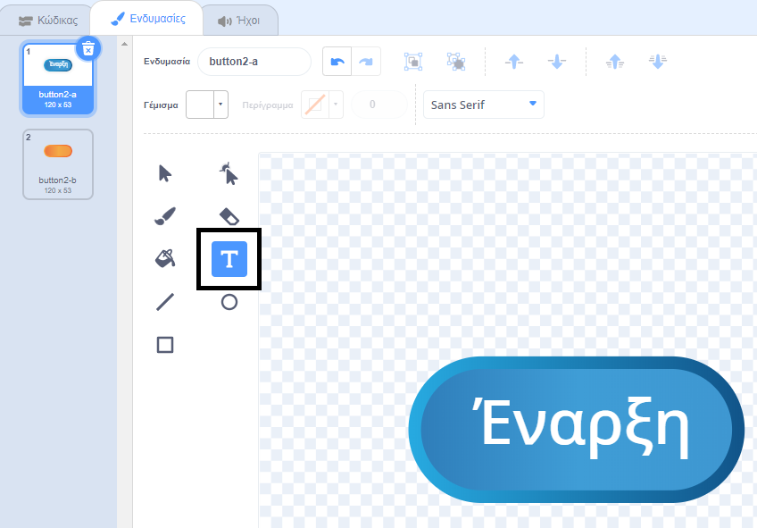
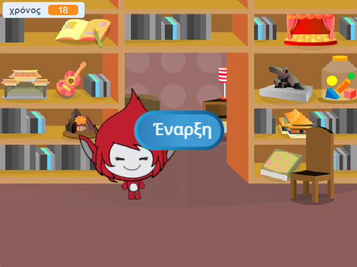
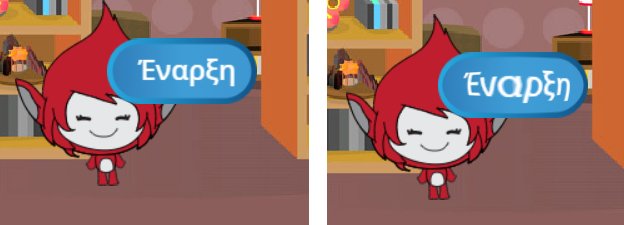

## Πολλαπλά παιχνίδια

Ας προσθέσουμε ένα κουμπί "play" στο παιχνίδι σου, έτσι ώστε να μπορείς να παίξεις πολλές φορές.

+ Δημιούργησε ένα νέο κουμπί-sprite "Play", το οποίο θα κάνει ο παίκτης σου για να ξεκινήσει ένα νέο παιχνίδι. Μπορείς να το σχεδιάσεις μόνος σου ή να επεξεργαστείς ένα sprite από τη βιβλιοθήκη Scratch.
    
    

+ Πρόσθεσε αυτόν τον κώδικα στο νέο σου κουμπί.
    
    ```blocks
        when flag clicked
        show
    
        when this sprite clicked
        hide
        broadcast [start v]
    ```
    
    Αυτός ο κώδικας εμφανίζει το κουμπί "play" κατά την εκκίνηση του έργου σου. Όταν πατηθεί το κουμπί, κρύβεται και μετά μεταδίδει ένα μήνυμα ότι θα ξεκινήσει το παιχνίδι.

+ Θα χρειαστεί να επεξεργαστείς τον κώδικα του χαρακτήρα σου, έτσι ώστε το παιχνίδι να ξεκινά όταν λάβει το μήνυμα `start`{: class = "blockevents"}, και όχι όταν έχει γίνει κλικ στο flag.
    
    Αντικατέστησε τον κώδικα `when flag clicked`{:class="blockevents"} με τον `when I receive start`{:class="blockevents"}.
    
    

+ Κάνε κλικ στην πράσινη σημαία και, στη συνέχεια, κάνε κλικ στο νέο κουμπί "play" για να το δοκιμάσεις. Θα δειε ότι το παιχνίδι δεν ξεκινάει μέχρι να γίνει κλικ στο κουμπί.

+ Παρατήρησες ότι το χρονόμετρο ξεκινά όταν πατήσεις τη πράσινη σημαία και όχι όταν ξεκινά το παιχνίδι;
    
    
    
    Μπορείς να διορθώσεις αυτό το πρόβλημα;

+ Κάνε κλικ στη σκηνή και αντικατέστησε το μπλοκ `stop all`{: class = "blockcontrol"} με το μήνυμα `end`{: class = "blockevents"}.
    
    

+ Τώρα μπορείς να προσθέσεις κώδικα στο κουμπί σου, για να το εμφανίσεις ξανά στο τέλος κάθε παιχνιδιού.
    
    ```blocks
        when I receive [end v]
        show
    ```

+ Θα χρειαστεί επίσης να σταματήσεις τον χαρακτήρα σου να θέτει ερωτήσεις στο τέλος κάθε παιχνιδιού:
    
    ```blocks
        when I receive [end v]
        stop [other scripts in sprite v]
    ```

+ Δοκιμάσε το κουμπί "play" παίζοντας μερικά παιχνίδια. Θα παρατηρήσεις ότι το κουμπί αναπαραγωγής εμφανίζεται μετά από κάθε παιχνίδι. Για να διευκολύνεις τον έλεγχο, μπορείς να συντομεύσεις κάθε παιχνίδι, έτσι ώστε να διαρκεί μόνο μερικά δευτερόλεπτα.
    
    ```blocks
        set [time v] to [10]
    ```

+ Μπορείς ακόμα να αλλάξεις τον τρόπο εμφάνισης του κουμπιού όταν το ποντίκι περνάει από πάνω του.
    
    ```blocks
        when flag clicked
        show
        forever
        if <touching [mouse-pointer v]?> then
            set [fisheye v] effect to (30)
        else
            set [fisheye v] effect to (0)
        end
        end
    ```
    
    