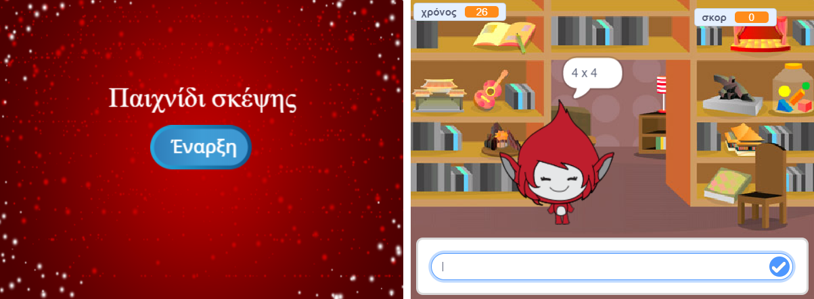

\--- πρόκληση \---

## Πρόκληση: Αρχική οθόνη

Μπορείτε να προσθέσετε ένα άλλο σκηνικό στη σκηνή σας, το οποίο θα γίνει η οθόνη έναρξης του παιχνιδιού σας; Μπορείτε να χρησιμοποιήσετε το `όταν λαμβάνω εκκίνηση`{: class = "blockevents"} και `όταν λαμβάνω τερματικά`{: class = "blockevents"} μπλοκ για εναλλαγή μεταξύ σκηνικών.

Μπορείτε επίσης να εμφανίσετε και να αποκρύψετε τον χαρακτήρα σας, ακόμα και να εμφανίσετε και να αποκρύψετε το χρονοδιακόπτη σας χρησιμοποιώντας αυτά τα μπλοκ:

```blocks
εμφάνιση μεταβλητής [time v]
```

```blocks
απόκρυψη μεταβλητής [time v]
```



\--- / πρόκληση \---