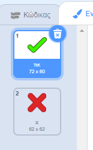

## Προσθήκη γραφικών

Αντί του χαρακτήρα σου λέει μόνο `ναι! :)` ή `nope :(` στον παίκτη, ας προσθέσουμε κάποια γραφικά που θα επιτρέψουν στον παίκτη να ξέρει πώς κάνουν.

+ Δημιουργήστε ένα νέο σκίτσο που ονομάζεται 'Αποτέλεσμα', το οποίο περιέχει τόσο κοστούμι 'tick' όσο και 'cross'.
    
    

+ Αλλάξτε τον κώδικα του χαρακτήρα σας, έτσι ώστε αντί να λέει στον παίκτη πώς έκαναν, μεταδίδει `σωστά`{: class = "blockevents"} και `λάθος`{: class = "blockevents"} μηνύματα.
    
    

+ Τώρα μπορείτε να χρησιμοποιήσετε αυτά τα μηνύματα για να εμφανίσετε το κοστούμι 'tick' ή 'cross'. Προσθέστε αυτόν τον κώδικα στο νέο σας sprite "Αποτέλεσμα":
    
    

+ Δοκιμάστε ξανά το παιχνίδι σας. Θα πρέπει να δείτε ένα τσιμπούρι κάθε φορά που θα έχετε μια σωστή ερώτηση και ένα σταυρό κάθε φορά που θα πάρετε ένα λάθος!
    
    

+ Παρατηρήσατε ότι ο κωδικός για το `όταν λαμβάνω σωστή`{: class = "blockevents"} και `όταν λαμβάνω λάθος`{: class = "blockevents"} είναι σχεδόν πανομοιότυπος; Ας δημιουργήσουμε μια λειτουργία που θα σας διευκολύνει να κάνετε αλλαγές στον κώδικα σας.
    
    Στον sprite "Αποτέλεσμα", κάντε κλικ στο κουμπί `Περισσότερα μπλοκ`{: class = "blockmoreblocks"} και, στη συνέχεια, κάντε "Δημιουργία μπλοκ". Δημιουργήστε μια νέα λειτουργία που ονομάζεται `animate`{: class = "blockmoreblocks"}.
    
    

+ Στη συνέχεια, μπορείτε να προσθέσετε τον κώδικα κινούμενης εικόνας στη νέα λειτουργία κινούμενης εικόνας και στη συνέχεια να χρησιμοποιήσετε τη λειτουργία δύο φορές:
    
    

+ Τώρα, εάν θέλετε να δείξετε το τσιμπούρι και το σταυρό για μεγαλύτερο ή μικρότερο χρονικό διάστημα, χρειάζεται μόνο να κάνετε μια αλλαγή στον κωδικό σας. Δοκίμασέ το!

+ Αντί να δείχνετε απλά και να κρύβετε το τσιμπούρι και το σταυρό, μπορείτε να αλλάξετε τη λειτουργία κινούμενης εικόνας, έτσι ώστε τα γραφικά να ξεθωριάζουν.
    
    ```blocks
        καθορίστε [animate]
        set [ghost v] effect to (100) show repeat (25) αλλάξτε [ghost v] αποτέλεσμα από (-4) end hide
    ```