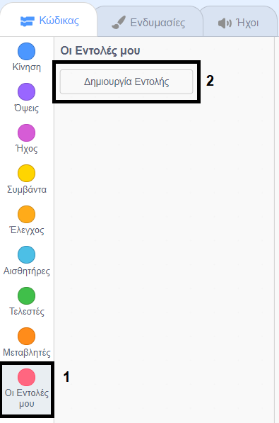

## Πρόσθεσε γραφικά

Αυτή τη στιγμή ο χαρακτήρας sprite λέει ` ναι! :) ` ή ` όχι :( ` στις απαντήσεις του παίκτη. Πρόσθεσε μερικά γραφικά για να ενημερώσεις τον παίκτη εάν η απάντησή του είναι σωστή ή λανθασμένη.

\--- task \---

Δημιούργησε ένα νέο αντικείμενο που ονομάζεται 'Αποτέλεσμα', το οποίο περιλαμβάνει τις ενδυμασίες 'tick' (τικ) και 'cross' (χι).


\--- /task \---

\--- task \---

Άλλαξε τον κώδικα του χαρακτήρα σου έτσι ώστε, αντί να λέει κάτι στον παίκτη, να `μεταδίδει`{:class="block3events"} τα μηνύματα "σωστό" ή "λάθος".


```blocks3
if <(answer) = ((number 1)*(number 2))> then

- say [yes! :)] for (2) seconds
+ broadcast (correct v)
else
- say [nope :(] for (2) seconds
+ broadcast (wrong v)
end
```

\--- /task \---

\--- task \---

Τώρα μπορείς να χρησιμοποιήσεις αυτά τα μηνύματα για να `εμφανίσεις`{:class="block3looks"} την ενδυμασία "tick" ή "cross". Πρόσθεσε τον παρακάτω κώδικα στο αντικείμενο "Αποτέλεσμα":


```blocks3
    when I receive [correct v]
    switch costume to (tick v)
    show
    wait (1) seconds
    hide

    when I receive [wrong v]
    switch costume to (cross v)
    show
    wait (1) seconds
    hide

    when flag clicked
    hide
```

\--- /task \---

\--- task \--- Δοκίμασε ξανά το παιχνίδι σου. Θα δεις ένα τικ κάθε φορά που θα έχεις μια σωστή απάντηση και ένα χι κάθε φορά που θα έχεις μια λάθος!


\--- /task \---

Βλεπεις ότι ο κώδικας για το `when I receive correct`{:class="block3events"} και `when I receive wrong`{:class="block3events"} είναι σχεδόν πανομοιότυπος;

Για να μπορείς να αλλάξεις τον κώδικά σου πιο εύκολα, θα δημιουργήσεις ένα προσαρμοσμένο μπλοκ.

\--- task \---

Επίλεξε το αντικείμενο "Αποτέλεσμα". Στη συνέχεια, κάνε κλικ στο `Τα μπλοκ μου`{:class="block3myblocks"}, και στη συνέχεια στο **Δημιουργία μπλοκ** . Δημιούργησε ένα νέο μπλοκ και ονόμασέ το `κίνηση`{:class="block3myblocks"}.




\--- /task \---

\--- task \--- Μετακίνησε τον κώδικα για την `εμφάνιση`{:class="block3looks"} και την `απόκρυψη`{:class="block3looks"} του αντικειμένου 'Αποτέλεσμα' στο μπλοκ `κίνηση`{:class="block3myblocks"}:


```blocks3
define animate
show
wait (1) seconds
hide
```

\--- /task \---

\--- task \--- Βεβαιώσου ότι έχεις αφαιρέσει τον κώδικα για την `εμφάνιση`{:class="block3looks"} και την `απόκρυψη`{:class="block3looks"} κάτω **και από τα δύο** μπλοκ των `ενδυμασιών`{:class="block3looks"}.

Then add the `animate`{:class="block3myblocks"} block below both of the `switch costume`{:class="block3looks"} blocks. Your code should now look like this:


```blocks3
    when I receive [correct v]
    switch costume to (tick v)
    animate:: custom

    when I receive [wrong v]
    switch costume to (cross v)
    animate:: custom
```

\--- /task \---

Because of the custom `animate`{:class="block3myblocks"} block, you now only need to make one change to your code if you want to show the 'Result' sprite's costumes a longer or shorter time.

\--- task --

Change your code so that the 'tick' or 'cross' costumes display for 2 seconds.

\--- /task \---

\--- task \--- Instead of `showing`{:class="block3looks"} and `hiding`{:class="block3looks"} the 'tick' or 'cross' costumes, you could change your `animate`{:class="block3myblocks"} block so that the costumes fade in.


```blocks3
    define animate
    set [ghost v] effect to (100)
    show
    repeat (25)
        change [ghost v] effect by (-4)
    end
    hide
```

\--- /task \---

Can you improve the animation of the 'tick' or 'cross' graphics? You could add code to make the costumes fade out as well, or you could use other cool effects:

