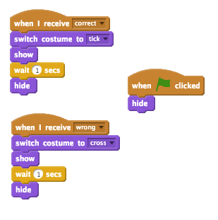

## Προσθήκη γραφικών

Αντί ο χαρακτήρας σου να λέει μόνο `yes! :)` (ναι) ή `nope :(` (όχι) στον παίκτη, ας προσθέσουμε κάποια γραφικά που θα επιτρέψουν στον παίκτη να ξέρει πώς τα πηγαίνει.

+ Δημιούργησε ένα νέο sprite που ονομάζεται 'Result', το οποίο περιέχει ένα κοστούμι 'tick' (τικ) κι ένα 'cross' (χι).
    
    

+ Άλλαξε τον κώδικα του χαρακτήρα σου, έτσι ώστε αντί να λέει στον παίκτη πώς τα πηγαίνει, να μεταδίδει μηνύματα `correct`{:class="blockevents"} (σωστά) και `wrong</0{:class="blockevents"} (λάθος).</p>

<p></p></li>
<li><p>Τώρα μπορείς να χρησιμοποιήσεις αυτά τα μηνύματα για να εμφανίσεις το κοστούμι 'tick' ή 'cross'. Πρόσθεσε αυτόν τον κώδικα στο νέο σου αντικείμενο (sprite) "Result":</p>

<p></p></li>
<li><p>Δοκίμασε ξανά το παιχνίδι σου. Θα δεις ένα τικ κάθε φορά που θα έχεις μια σωστή απάντηση και ένα χι κάθε φορά που θα έχεις μια λάθος!</p>

<p></p></li>
<li><p>Παρατήρησες ότι ο κώδικας για το <code>when I receive correct`{:class="blockevents"} και `when I receive wrong`{:class="blockevents"} είναι σχεδόν πανομοιότυπος; Ας δημιουργήσουμε μια συνάρτηση που θα σε διευκολύνει να κάνεις αλλαγές στον κώδικά σου.
    
    Στο αντικείμενο "Result", κάνε κλικ στο κουμπί `More Blocks`{:class="blockmoreblocks"} (περισσότερα μπλοκ) και, στη συνέχεια, κάνε "Make a Block" (Δημιουργία μπλοκ). Δημιούργησε μια νέα συνάρτηση που ονομάζεται `animate`{:class="blockmoreblocks"} (κίνηση εικόνας).
    
    

+ Στη συνέχεια, μπορείς να προσθέσεις τον κώδικα κινούμενης εικόνας στη νέα συνάρτηση κινούμενης εικόνας και μετά να χρησιμοποιήσεις τη συνάρτηση δύο φορές:
    
    

+ Τώρα, εάν θέλεις να δείξεις το τικ και το χι για μεγαλύτερο ή μικρότερο χρονικό διάστημα, χρειάζεται μόνο να κάνεις μια αλλαγή στον κώδικά σου. Δοκίμασέ το!

+ Αντί να εμφανίζεις απλά και να εξαφανίζεις το τικ και το χι, μπορείς να αλλάξεις τη συνάρτηση κινούμενης εικόνας, έτσι ώστε τα γραφικά να ξεθωριάζουν.
    
    ```blocks
        define [animate]
        set [ghost v] effect to (100)
        show
        repeat (25)
            change [ghost v] effect by (-4)
        end
        hide
    ```