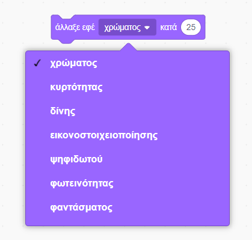

\--- challenge \---

## Πρόκληση: Βελτιωμένη κινούμενη εικόνα

Μπορείς να βελτιώσεις την κινούμενη εικόνα των γραφικών σου; Θα μπορούσες να προγραμματίσεις το τικ (tick) και το χι (cross) να εμφανίζονται σταδιακά και να ξεθωριάζουν. Ή μπορείς να χρησιμοποιήσεις κι άλλα ενδιαφέροντα εφέ:

\--- /challenge \---