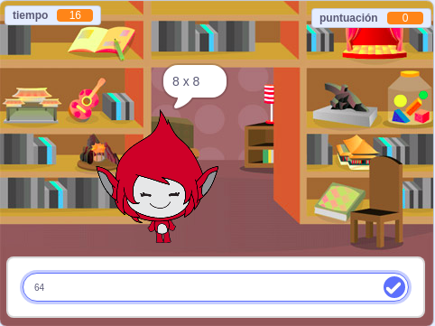

\--- no-print \---

Esta es la versión **Scratch 3** del proyecto. También hay una versión [Scratch 2 del proyecto](https://projects.raspberrypi.org/en/projects/brain-game-scratch2).

\--- /no-print \---

## Introducción

En este proyecto crearás una prueba de matemáticas en la que el jugador tendrá 30 segundos para dar tantas respuestas correctas como pueda.

### Lo que harás

\--- no-print \---

Haz clic en el botón para comenzar. Escribe la respuesta a la pregunta y después pulsa la tecla <kbd>Enter</kbd>.

  <iframe allowtransparency="true" width="485" height="402" src="https://scratch.mit.edu/projects/embed/250234955/?autostart=false" frameborder="0" scrolling="no"></iframe>
  

\--- /no-print \---

\--- print-only \---

\--- /print-only \---

## \--- collapse \---

## title: Lo que aprenderás

+ Cómo utilizar transmisiones en Scratch
+ Cómo crear y utilizar bloques de Scratch personalizados

\--- /collapse \---

## \--- collapse \---

## title: Lo que necesitarás

### Hardware

+ Un ordenador capaz de ejecutar Scratch 3

### Software

+ Scratch 3 (ya sea [en línea](http://rpf.io/scratchon){:target="_blank"} o [sin conexión](http://rpf.io/scratchoff) {:target="_blank"})

\--- /collapse \---

## \--- collapse \---

## Información adicional para educadores

\--- no-print \---

Si necesitas imprimir este proyecto, usa la [versión para imprimir](https://projects.raspberrypi.org/en/projects/brain-game/print).

\--- /no-print \---

Puedes encontrar [el proyecto completo aquí](http://rpf.io/p/en/brain-game-get){:target ="_blank"}.

\--- /collapse \---