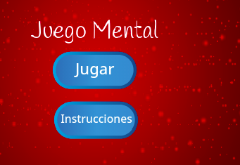

--- challenge ---

## Desafío: Pantalla de instrucciones

¿Puedes agregar una pantalla de instrucciones a tu juego, diciéndole a tu jugador cómo jugarlo? Necesitarás un botón de 'Instrucciones' y otro fondo de escenario.



Puede que también necesites un botón 'Atrás' que te llevará al menú principal.

```blocks
    enviar [main menu v]
```

--- /challenge ---