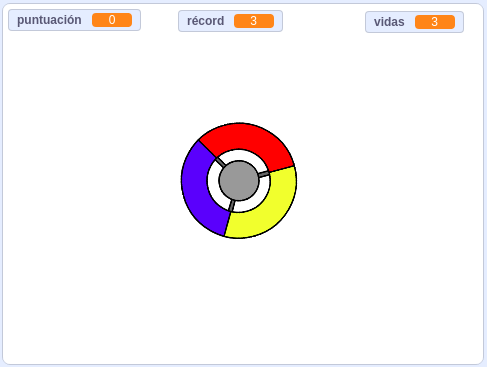

## Y ahora ¿qué?

¡Prueba el proyecto [Atrapa los puntos](https://projects.raspberrypi.org/en/projects/catch-the-dots?utm_source=pathway&utm_medium=whatnext&utm_campaign=projects) para crear un juego de velocidad de reacción! En ese proyecto aprenderás a hacer clones de objetos y a usar variables para incrementar la velocidad del juego gradualmente.

\--- no-print \---

Utiliza las teclas de dirección de tu teclado para girar el controlador y atrapar los puntos voladores a medida que llegan al centro. Si no eres capaz de atrapar tres puntos se acaba el juego. 

  <iframe allowtransparency="true" width="485" height="402" src="https://scratch.mit.edu/projects/embed/252923761/?autostart=false" frameborder="0" scrolling="no"></iframe>
  

\--- /no-print \---

\--- print-only \---

\--- /print-only \---