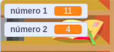

## Crear preguntas

Vas a empezar por crear preguntas aleatorias que el jugador tendrá que contestar.

\--- task \---

Abre un nuevo proyecto en Scratch.

**Online:** abre un nuevo proyecto en [rpf.io/scratch-new](http://rpf.io/scratch-new){:target="_blank"}.

**Offline:** abre un nuevo proyecto en el editor offline.

Si necesitas descargar e instalar el editor offline de Scratch, puedes encontrarlo en [rpf.io/scratchoff](http://rpf.io/scratchoff){:target="_blank"}.

\--- /task \---

\--- task \--- Añade un objeto de personaje y un fondo para tu juego. ¡Puedes escoger el que quieras! Aquí tienes un ejemplo:


\--- /task \---

\--- task \--- Asegúrate de tener tu objeto de personaje seleccionado. Crea dos nuevas variables llamadas `número 1`{:class="block3variables"} y `número 2`{:class="block3variables"} para almacenar los número para las preguntas del test.

 

[[[generic-scratch3-add-variable]]]

\--- /task \---

\--- task \--- Añade código a tu objeto de personaje para dar a tus dos `variables`{:class="block3variables"} un número `aleatorio`{:class="block3operators"} entre 2 y 12.


```blocks3
al hacer clic en la bandera verde
dar a [número 1 v] el valor (número aleatorio entre (2) y (12))
dar a [número 2 v] el valor (número aleatorio entre (2) y (12))
```

\--- /task \---

\--- task \--- Añade código para `preguntar`{:class="block3sensing"} al jugador por la respuesta. Después, hay que `decir durante 2 segundos`{:class="block3looks"} si la respuesta ha sido correcta o errónea:


```blocks3
al hacer clic en la bandera verde
dar a [número 1 v] el valor (número aleatorio entre (2) y (12))
dar a [número 2 v] el valor (número aleatorio entre (2) y (12))

+ preguntar (unir (número 1)(unir [ x ] (número 2))) y esperar
+ si <(respuesta) = ((número 1)*(número 2))> entonces
+ decir [¡sí! :)] durante (2) segundos
+ si no
+ decir [no :(] durante (2) segundos
+ fin
```

\--- /task \---

\--- task \---

Prueba tu proyecto dos veces: responde una pregunta bien y otra mal.

\--- /task \---

\--- task \---

Añade un bucle `por siempre`{:class="block3control"} que englobe este código para que el juego haga muchas preguntas seguidas.

\--- hints \--- \--- hint \---

Tienes que añadir un bloque `por siempre`{:class="block3control"} y poner todo el código excepto el bloque `al hacer clic en la bandera verde`{:class="block3control"} dentro de él.

\--- /hint \--- \--- hint \--- Éste es el bloque que necesitarás:

```blocks3
por siempre
fin
```

\--- /hint \--- \--- hint \--- Aquí está el código que necesitarás:

```blocks3
al hacer clic en la bandera verde
+ por siempre
    dar a [número 1 v] el valor (número aleatorio entre (2) y (12))
    dar a [número 2 v] el valor (número aleatorio entre (2) y (12))
    preguntar (unir (número 1)(unir [ x ] (número 2))) y esperar
    si <(respuesta) = ((número 1)*(número 2))> entonces
        decir [¡sí! :)] durante (2) segundos
    si no
        decir [no :(] durante (2) segundos
    fin
fin
```

\--- /hint \--- \--- /hints \---

\--- /task \---