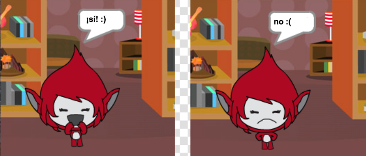

## Desafío: Añadir una puntuación y reacciones

¿Puedes añadir una puntuación a tu juego?

Podrías añadir código para que el jugador gane un punto con cada respuesta correcta. Si te apetece ser un poco malvado ¡puedes añadir código para poner a cero la puntuación si el jugador se equivoca!

[[[generic-scratch3-high-score]]]

¿Puedes hacer que tu personaje reaccione a las respuestas del jugador cambiando su disfraz en función de si la respuesta es correcta o errónea?

