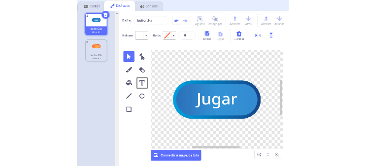
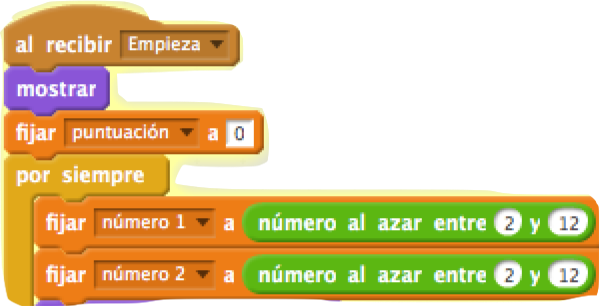
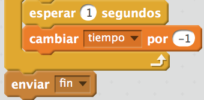
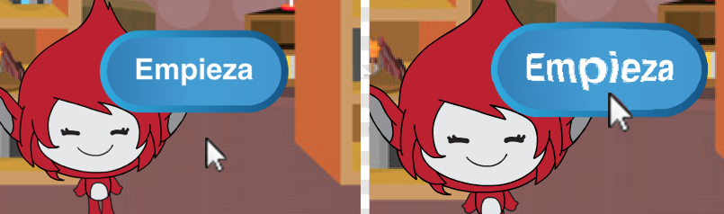

## Múltiples partidas

Vamos a añadir un botón de 'jugar' a tu juego, para que puedas jugar muchas veces.


+ Crea un nuevo objeto con un botón de 'Jugar', en el que tu jugador hará clic para empezar un juego nuevo. Puedes dibujarlo tú o editar un objeto de la biblioteca de Scratch.

	

+ Añade este código a tu nuevo botón.

	```blocks
		al presionar bandera verde
		mostrar

		al hacer clic en este objeto
		esconder
		enviar [inicio v]
	```

	Este código muestra el botón de jugar cuando el proyecto empieza. Al presionar el botón, éste se esconde y envía un mensaje que dará inicio al juego.

+ Necesitarás editar el código de tu personaje para que el juego empiece cuando éste recibe el mensaje de `inicio` {.blockevents}, y no al presionar la bandera.

	Sustituye el código `al presionar bandera verde` {.blockevents} por `al recibir inicio` {.blockevents}.

	

+ Haz clic en la bandera verde y a continuación presiona tu nuevo botón de jugar para probarlo. No deberías de ver el juego empezar hasta que se haga clic en el botón.

+ ¿Te has dado cuenta de que el cronómetro arranca cuando haces clic en la bandera verde, y no cuando empieza el juego?

	

	¿Puedes arreglar este problema?

+ Haz clic en el escenario, y sustituye el bloque `detener todos` {.blockcontrol} por un mensaje de `fin` {.blockevents}.

	

+ Ahora puedes añadir código al botón para que vuelva a aparecer al final de cada partida.

	```blocks
		al recibir [fin v]
		mostrar
		```

+ También tendrás que hacer que tu personaje deje de hacer preguntas al final de cada partida:

	```blocks
		al recibir [fin v]
		detener [otros programas en el objeto v]
		```

+ Prueba el botón jugando un par de partidas. Deberías de ver aparecer el botón de jugar después de cada partida. Para que sea más fácil hacer las pruebas, puedes acortar las partidas y hacer que duren sólo unos segundos.

	```blocks
		fijar [tiempo v] a [10]
	```

+ Incluso puedes hacer que la apariencia del botón cambie cuando le acercas el ratón.

	```blocks
		al presionar bandera verde
		mostrar
		por siempre
   		si <¿tocando [puntero del ratón v]?> entonces
      		establecer efecto [ojo de pez v] a (30)
   		si no
      		establecer efecto [ojo de pez v] a (0)
   		fin
		fin
	```

	


