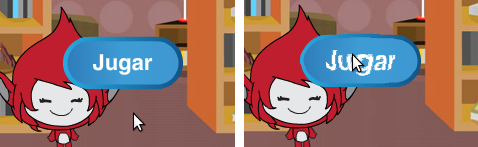

## Varias partidas

Ahora vas a añadir un botón en el que ponga "Jugar", para que el jugador poder jugar muchas veces a tu juego.

\--- task \---

Crea un nuevo objeto para el botón de “Jugar”. El jugador tendrá que pulsarlo para comenzar una nueva partida.

Puedes dibujar el objeto o editar uno ya existente.


\--- /task \---

\--- task \---

Añade este código a tu objeto del botón:


```blocks3
    al hacer clic en la bandera
    mostrar

    al hacer clic en este objeto
    esconder
    transmisión (empezar v)
```

\--- /task \---

Este nuevo código incluye otro bloque `transmisión`{:class="block3events"} que envía el mensaje "empezar".

The new code makes the 'Play' button sprite show when player clicks on the flag. Cuando el jugador haga clic en el objeto del botón éste se esconderá y enviará un mensaje al que otros objetos podrán reaccionar.

Por ahora el personaje empieza a hacer preguntas en cuanto se hace clic en la bandera. Cambia el código de tu juego para que el personaje empiece a hacer preguntas cuando reciba el mensaje "empezar" que enviamos con el bloque `enviar`{:class="block3events"}.

\--- task \---

Selecciona el objeto de tu personaje y sustituye el bloque `al hacer clic en la bandera`{:class="block3events"} por el bloque `al recibir empezar`{:class="block3events"}.


```blocks3
<br />- al hacer clic en la bandera
+ al recibir [empezar v]
dar a [número 1 v] el valor (número aleatorio entre (2) y (12))
dar a [número 2 v] el valor (número aleatorio entre (2) y (12))
preguntar (unir (número 1)(unir [ x ] (número 2))) y esperar
si <(respuesta) = ((número 1)*(número 2))> entonces
    decir [¡sí! :)] durante (2) segundos
si no
    decir [no :(] durante (2) segundos
fin
```

\--- /task \---

\--- task \---

Haz clic en la bandera verde y después en el botón "Jugar" para ver si funciona. Deberías ver que el juego no empieza antes de que hagas clic en el botón.

\--- /task \---

¿Te has fijado en que el cronómetro empieza cuando se hace clic en la bandera verde en vez de cuando se pulsa el botón?


\--- task \---

¿Puedes cambiar el código del cronómetro para que empiece cuando el jugador haga clic en el botón?

\--- /task \---

\--- task \---

Añade código a tu objeto del botón para que aparezca de nuevo al final de cada partida.


```blocks3
    al recibir [final v]
    mostrar
```

\--- /task \---

\--- task \---

Prueba el botón "Jugar" echando un par de partidas. El botón debería aparecer al final de cada una.

Para probar el juego más rápido puedes cambiar el valor de `tiempo`{:class="block3variables"} para que las partidas duren solo unos segundos.


```blocks3
    dar a [time v] el valor [10]
```

\--- /task \---

\--- task \---

Puedes cambiar el aspecto del botón cuando el ratón pasa por encima.


```blocks3
    al hacer clic en la bandera
    mostrar
    continuo
    si <touching (mouse-pointer v)?> entonces
        dar al efecto [ojo de pez v] el valor (30)
    si no
        dar al efecto [ojo de pez v] el valor (0)
    fin
    fin
```



\--- /task \---