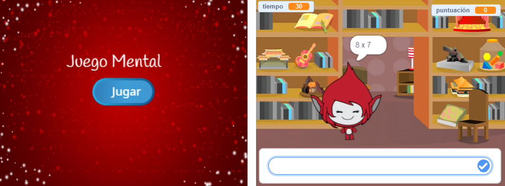

--- challenge ---
## Desafío: Pantalla de inicio
¿Puedes añadir otro fondo a tu escenario, que se convertirá en la pantalla de inicio del juego? Puedes usar los bloques `al recibir inicio` {.blockevents} y `al recibir fin` {.blockevents} para cambiar de un escenario a otro.

También puedes mostrar y esconder a tu personaje, e incluso mostrar y esconder el cronómetro, si usas estos bloques:

```blocks
mostrar variable [tiempo v]
```
```blocks
esconder variable [tiempo v]
```




--- /challenge ---