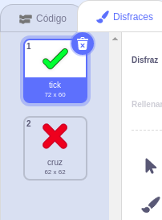
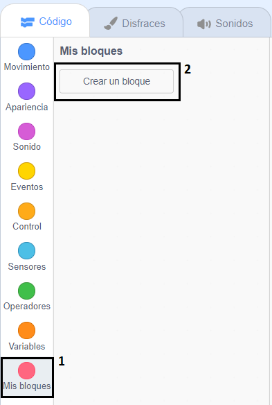
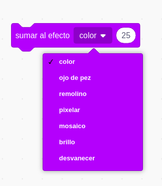

## Añadir gráficos

Por ahora el objeto del jugador solo responde `¡sí! :)` o `no :(` a las respuestas del jugador. Añade algunos gráficos para que el jugador sepa si la respuesta es correcta o incorrecta.

\--- task \---

Crea un nuevo objeto llamado "Resultado" y dale dos disfraces: un "tick" y una "cruz".



\--- /task \---

\--- task \---

Cambia el código de tu objeto de personaje para que, en vez de decirle algo al jugador `envíe`{:class="block3events"} los mensajes "correcto" o "incorrecto".


```blocks3
si <(respuesta) = ((número 1)*(número 2))> entonces

- decir [¡sí! :)] durante (2) segundos
+ enviar (correcto v)
si no
- decir [no :(] durante (2) segundos
+ enviar mensaje (incorrecto v)
fin
```

\--- /task \---

\--- task \---

Ahora puedes usar los mensajes para `mostrar`{:class="block3looks"} los disfraces de "tick" o de "cruz". Añade el siguiente código al objeto "Resultado":


```blocks3
    al recibir [correcto v]
    cambiar disfraz a (tick v)
    mostrar
    esperar (1) segundos
    esconder

    al recibir [incorrecto v]
    cambiar disfraz a (cruz v)
    mostrar
    esperar (1) segundos
    esconder

    al hacer clic en la bandera verde
    esconder
```

\--- /task \---

\--- task \---

Prueba tu juego otra vez. ¡Deberías ver el “tick” cada vez que la respuesta sea correcta y la “cruz” cada vez que la respuesta sea incorrecta! 


\--- /task \---

¿Te has dado cuenta de que el código de `al recibir correcto`{:class="block3events"} y de `al recibir incorrecto`{:class="block3events"} es casi idéntico?

Para poder cambiar el código de manera más sencilla vas a crear un bloque personalizado.

\--- task \---

Selecciona el objeto de "Resultado". Después haz clic en `Mis bloques`{:class="block3myblocks"} y luego en **Crear un bloque**. Crea un nuevo bloque y llámalo `animar`{:class="block3myblocks"}.




\--- /task \---

\--- task \---

Mueve el código para `mostrar`{:class="block3looks"} y `ocultar`{:class="block3looks"} el objeto del 'Resultado' al bloque `animar`{:class="block3myblocks"}:


```blocks3
definir animar
mostrar
esperar (1) segundos
ocultar
```

\--- /task \---

\--- task \---

Asegúrate de haber eliminado los bloques `mostrar`{:class="block3looks"} y `ocultar`{:class="block3looks"} debajo de **ambos** de los bloques `cambiar disfraz a`{:class="block3looks"}.

Después añade el bloque `animar`{:class="block3myblocks"} debajo de ambos bloques `cambiar disfraz a`{:class="block3looks"}. Tu código debería parecerse a éste:


```blocks3
    al recibir [correcto v]
    cambiar disfraz a (tick v)
    animar:: custom

    al recibir [incorrecto v]
    cambiar disfraz a (cruz v)
    animar:: custom
```

\--- /task \---

Gracias al bloque personalizado `animar`{:class="block3myblocks"} ahora solo tenemos que hacer un cambio en nuestro código si queremos mostrar el objeto de "Resultado" durante más o menos tiempo.

\--- task \---

Cambia tu código para que se muestren los disfraces de "tick" y "cruz" durante 2 segundos.

\--- /task \---

\--- task \---

En vez de `mostrar`{:class="block3looks"} y `ocultar`{:class="block3looks"} los disfraces de "tick" y "cruz", puedes cambiar el bloque `animar`{:class="block3myblocks"} para que los disfraces aparezcan gradualmente.


```blocks3
    definir animar
    dar al efecto [desvanecer v] el valor (100)
    mostrar
    repetir (25)
        sumar al efecto [desvanecer v] (-4)
    fin
    esconder
```

\--- /task \---

¿Puedes mejorar los gráficos de la animación del "tick" o de la "cruz"? Podrías añadir código para hacer que los disfraces también desaparezcan gradualmente o puedes usar estos otros efectos chulos:

