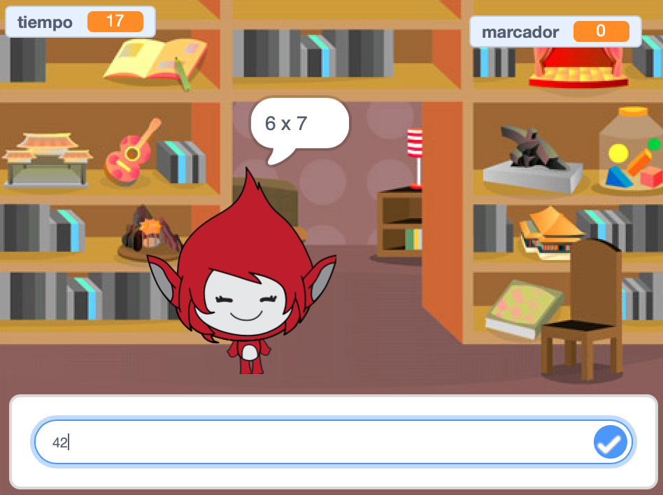

\--- no-print \---

Esta es la versión **Scratch 3** del proyecto. También existe una versión [Scratch 2 del proyecto](https://projects.raspberrypi.org/en/projects/brain-game-scratch2).

\--- /no-print \---

## Introducción

En este proyecto crearás una prueba de matemáticas, en la cual el jugador tiene 30 segundos para dar tantas respuestas correctas como sea posible.

### Lo que harás

\--- no-print \---

Presiona el botón para empezar. Escribe la respuesta a la pregunta, y luego presiona la tecla <kbd>Enter</kbd>.

  <iframe allowtransparency="true" width="485" height="402" src="https://scratch.mit.edu/projects/embed/250234955/?autostart=false" frameborder="0" scrolling="no"></iframe>
  

\--- /no-print \---

\--- print-only \---

\--- /print-only \---

## \--- collapse \---

## title: Lo que vas a aprender

+ Cómo usar transmisiones en Scratch
+ ¿Cómo crear y usar un bloque de Scratch personalizado?

\--- /collapse \---

## \--- collapse \---

## title: Lo que vas a necesitar

### Equipo

+ Una computadora capaz de ejecutar Scratch 3

### Programa

+ Scratch 3 (ya sea [con Internet](http://rpf.io/scratchon){:target="_blank"} o [sin Internet](http://rpf.io/scratchoff){:target="_blank"})

\--- /collapse \---

## \--- collapse \---

## título: Notas adicionales para educadores

\--- no-print \---

Si necesitas imprimir este proyecto, por favor, usa la [versión para imprimir](https://projects.raspberrypi.org/en/projects/brain-game/print).

\--- /no-print \---

Puedes encontrar el [ proyecto completo aquí ](http://rpf.io/p/en/brain-game-get){:target="_blank"}.

\--- /collapse \---