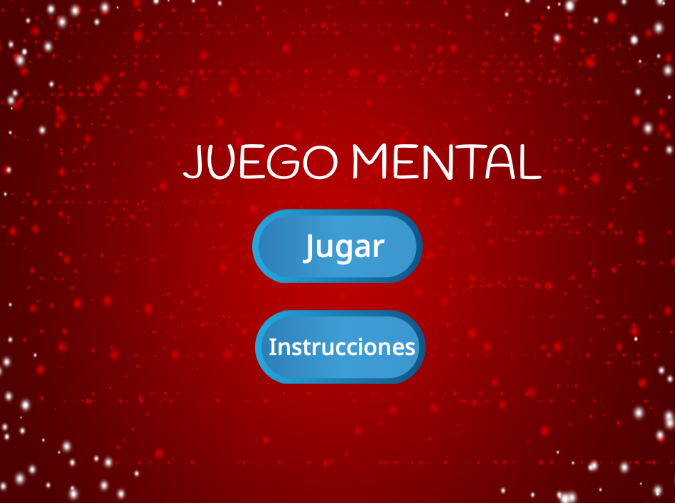

## Desafío: pantalla de instrucciones

¿Puedes añadir una pantalla de instrucciones que le diga al jugador cómo jugar? Para esto, necesitas un botón "Instrucciones", y otro fondo para el escenario.



Podrías también necesitar agregar un botón "Atrás" que le permita al jugador regresar a la pantalla de inicio.

```blocks3
    broadcast (pantalla de inicio v)
```